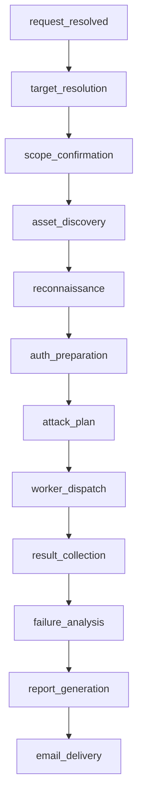

# 安全测试模式开发文档

## 1. 文档目标

本文档用于指导在 `Agent_Server` 中开发 `security_testing_mode`，目标是在现有 `FastAPI + LangGraph` 系统内，复刻 `pentagi` 的核心能力模型，构建一个面向 Web/API、主机、端口、网络侦察的多智能体安全测试模式。

本方案不是对 `pentagi` Go 代码做逐文件翻译，而是提炼其关键能力并映射到当前 Python 平台：

- 可恢复的任务状态机
- 主控智能体与专家智能体协同
- 受控的安全工具执行
- 失败反思与参数修复
- 执行记录、记忆、证据归档
- 结构化测试报告与邮件投递

## 2. 参考来源

本方案主要参考以下项目与文件：

- `G:\Code\Python\Python_selenium_test_Agent\pentagi\README.md`
- `G:\Code\Python\Python_selenium_test_Agent\pentagi\backend\docs\flow_execution.md`
- `G:\Code\Python\Python_selenium_test_Agent\pentagi\backend\docs\controller.md`
- `G:\Code\Python\Python_selenium_test_Agent\pentagi\backend\docs\docker.md`
- `G:\Code\Python\Python_selenium_test_Agent\pentagi\backend\pkg\providers\provider.go`
- `G:\Code\Python\Python_selenium_test_Agent\pentagi\backend\pkg\providers\performer.go`
- `G:\Code\Python\Python_selenium_test_Agent\pentagi\backend\pkg\tools\registry.go`
- `G:\Code\Python\Python_selenium_test_Agent\pentagi\backend\pkg\templates\prompts\pentester.tmpl`
- `G:\Code\Python\Python_selenium_test_Agent\Ai_Test_Agent\Enterprise_AI_QA_Agent\Agent_Server\src\graph\builder.py`
- `G:\Code\Python\Python_selenium_test_Agent\Ai_Test_Agent\Enterprise_AI_QA_Agent\Agent_Server\src\application\testing\mode_intent_service.py`
- `G:\Code\Python\Python_selenium_test_Agent\Ai_Test_Agent\Enterprise_AI_QA_Agent\Agent_Server\src\application\context\memory_runtime_service.py`
- `G:\Code\Python\Python_selenium_test_Agent\Ai_Test_Agent\Enterprise_AI_QA_Agent\Agent_Server\src\modes\api_testing_mode\runtime.py`
- `G:\Code\Python\Python_selenium_test_Agent\Ai_Test_Agent\Enterprise_AI_QA_Agent\Agent_Server\src\modes\api_testing_mode\subagent_coordinator.py`

## 3. 总体目标

`security_testing_mode` 的目标是让系统能够从自然语言安全测试请求出发，自动完成以下链路：

1. 识别用户意图、目标类型与测试范围
2. 建立安全测试 Campaign
3. 发现资产、端口、服务、Web/API 面
4. 拆解安全任务并分发给多个 worker 智能体
5. 调用系统已有工具与新增安全 runner 执行检测
6. 自动收集证据、生成 Finding、计算严重级别
7. 写入执行记录、记忆系统、artifact、observation
8. 生成 Markdown/HTML/JSON 报告
9. 按需通过邮件发送最终测试报告

## 4. PentAGI 到 Python 的映射原则

### 4.1 概念映射

| PentAGI | Python 安全模式 |
|---|---|
| Flow | SecurityCampaign |
| Task | SecurityObjective |
| Subtask | SecurityTask |
| Action | ToolExecutionRecord |
| Artifact/Memory | EvidenceArtifact / FindingMemory |
| Primary Agent | security-testing-agent |
| Pentester/Searcher/Coder/Adviser | 安全 worker 智能体 |

### 4.2 不直接照搬的部分

- 不逐个翻译 Go controller/provider 包
- 不重建 PentAGI 前端、GraphQL、Graphiti 全栈
- 不直接暴露 PentAGI 所有原始 shell 命令给顶层智能体

### 4.3 必须复刻的部分

- 任务分层和可恢复状态机
- 专家智能体委派模型
- 工具调用失败后的反思修复
- 证据、日志、记忆沉淀
- 标准化报告输出

## 5. 现有系统复用策略

### 5.1 必须复用的已有能力

- LangGraph 主图：`src/graph/builder.py`
- 模式意图识别：`src/application/testing/mode_intent_service.py`
- 记忆系统：`src/application/context/memory_runtime_service.py`
- 会话与状态存储：现有 session store / metadata
- 子智能体分发：`subagent-dispatch`
- 工具执行基础：`cli-executor`
- 知识检索：`knowledge-rag`
- 报告输出：`report-writer`
- 邮件发送：`send-email`
- artifact 持久化：`tool_job_service` / `artifact_storage_service`
- observation 记录：`observation_runtime_service`

### 5.2 需要新增的能力

- 安全模式专属 runtime
- 安全任务模型与任务池
- 安全工具目录与命令 profile
- runner 输出解析器
- 严重级别计算器
- 安全测试报告模板
- 安全失败分析与反思服务

## 5.3 模型使用约束

`security_testing_mode` 不允许单独直连任何第三方模型 API，不允许在 mode 内自行维护 OpenAI、Anthropic、Gemini 等 provider 调用代码。

安全模式中的所有模型调用，必须统一走系统现有模型运行时：

- `src/application/models/model_runtime_service.py`
- `src/graph/nodes/model_invoker.py`
- `src/registry/models.py`
- `src/application/model_adapters/registry.py`
- `src/schemas/model_config.py`
- `src/main.py`

### 5.3.1 系统统一模型调用链

现有系统的模型调用链已经完整存在：

1. `main.py` 初始化 `ModelRuntimeService`
2. LangGraph 节点 `model_invoker.py` 负责构造 `ModelInvocationRequest`
3. `ModelRuntimeService.invoke(model_key, request)` 统一调度模型
4. `ModelRegistry` 从数据库激活配置中解析运行时模型
5. `AdapterRegistry` 根据 `provider + transport` 选择适配器
6. 底层由系统现有 adapter 执行真实请求并返回统一结果

### 5.3.2 安全模式必须遵守的模型规则

- 所有主控智能体和 worker 智能体都只能使用系统中已注册、已激活的模型配置
- 模式内只允许传递 `model_key`，不允许直接传 `api_key`、`base_url`、`provider sdk client`
- 安全模式不能绕过 `ModelRegistry`
- 安全模式不能自行实例化 `httpx` 去请求第三方模型接口
- 安全模式不能在 mode 目录中重复实现 provider adapter
- worker 子智能体通过 `subagent-dispatch` 派发时，也必须继续走系统统一模型体系

### 5.3.3 模型选择方式

安全模式的模型选择应复用系统现有能力：

- agent 默认模型由 `src/registry/agents.py` 中的 `default_model` 定义
- 运行时实际模型由 `ModelRegistry.resolve_for_agent(...)` 解析
- 若用户、模式意图或 worker spec 显式指定 `model_key`，则仍由系统检查该模型是否处于激活状态
- 若无可用模型，则由系统返回统一的缺省错误结果，而不是 mode 自己处理 provider 错误

### 5.3.4 统一请求结构

安全模式如需构造模型调用请求，应遵循系统统一数据结构：

- `ModelInvocationRequest`
- `ModelInvocationResult`
- `UnifiedMessage`
- `ContentPart`
- `ModelToolCall`

这意味着：

- 主控与 worker 的提示、上下文、工具列表，最终都应映射到 `ModelInvocationRequest`
- 模型工具调用结果必须走系统现有的 `tool_calls` 协议
- 安全模式只负责构造 prompt、选择 agent、控制工具可见性，不负责实现底层模型协议兼容

### 5.3.5 当前系统支持的适配器

当前系统已经内置了统一适配器注册：

- `AnthropicMessagesAdapter`
- `GoogleGeminiGenerateContentAdapter`
- `OpenAIChatCompletionsAdapter`

后续如果系统继续增加 provider，`security_testing_mode` 不需要改调用方式，只需继续依赖 `ModelRuntimeService`。

### 5.3.6 安全模式中的落地要求

在 `security_testing_mode` 开发中，模型接入必须满足以下约束：

- mode runtime 只消费 `selected_model_key` 或 worker spec 中的 `model_key`
- 不在 `security_testing_mode` 目录下出现任何 provider SDK 直连代码
- 不新增独立的“安全模式模型客户端”
- 不把模型配置写死在 mode 中
- 所有模型行为都接受系统已有的日志、审批、流式输出和执行跟踪能力

### 5.3.7 结论

`security_testing_mode` 的模型层必须被视为“系统基础设施”，而不是模式私有能力。

模式负责：

- 组织提示词
- 决定使用哪个 agent
- 决定暴露哪些工具
- 决定 worker 使用哪个 `model_key`

系统负责：

- 管理模型配置
- 解析 provider/transport
- 处理 OAuth 或 API Key
- 发起模型请求
- 返回统一的工具调用结果
- 记录模型调用摘要

## 6. 模式架构设计

### 6.1 分层结构

1. Mode Layer
   `src/modes/security_testing_mode/`

2. Security Application Layer
   `src/application/security/`

3. Registry Layer
   `src/registry/agents.py`
   `src/registry/tools.py`

4. Reporting Layer
   `src/application/reporting/`

### 6.2 目录建议

建议新增以下文件：

- `src/modes/security_testing_mode/runtime.py`
- `src/modes/security_testing_mode/campaign_state.py`
- `src/modes/security_testing_mode/contracts.py`
- `src/modes/security_testing_mode/request_interpreter.py`
- `src/modes/security_testing_mode/asset_discovery_service.py`
- `src/modes/security_testing_mode/recon_planner.py`
- `src/modes/security_testing_mode/auth_strategy_planner.py`
- `src/modes/security_testing_mode/vulnerability_planner.py`
- `src/modes/security_testing_mode/task_pool.py`
- `src/modes/security_testing_mode/subagent_coordinator.py`
- `src/modes/security_testing_mode/report_builder.py`
- `src/modes/security_testing_mode/report_template.py`
- `src/modes/security_testing_mode/severity_evaluator.py`
- `src/modes/security_testing_mode/reflection_service.py`

建议新增以下通用安全能力文件：

- `src/application/security/tool_catalog.py`
- `src/application/security/command_profiles.py`
- `src/application/security/result_parsers.py`
- `src/application/security/execution_environment_service.py`
- `src/application/security/risk_policy.py`
- `src/application/security/finding_normalizer.py`

## 7. LangGraph 编排设计

### 7.1 编排原则

系统总图继续使用现有 LangGraph。`security_testing_mode` 作为工具模式，不绕开系统主图，而是在工具执行阶段进入 mode runtime。

模式内部再实现一张执行图，推荐节点如下：

### 7.2 阶段说明

- `target_resolution`：识别目标地址、域名、网段、应用入口
- `scope_confirmation`：确认测试边界与风险策略
- `asset_discovery`：归集主机、端口、服务、页面、接口
- `reconnaissance`：执行信息收集与指纹识别
- `auth_preparation`：处理账号、登录、凭证、令牌
- `attack_plan`：生成任务树与依赖关系
- `worker_dispatch`：派发 worker 子智能体
- `result_collection`：聚合结果与证据
- `failure_analysis`：处理失败、重试、反思、误报
- `report_generation`：生成测试报告
- `email_delivery`：邮件投递

## 8. 数据模型设计

建议建立如下模型：

- `SecurityTestingRequestState`
- `TargetCandidate`
- `AssetNode`
- `NetworkServiceFingerprint`
- `CredentialSession`
- `SecurityObjective`
- `SecurityTask`
- `FindingRecord`
- `EvidenceArtifact`
- `AgentActivityRecord`
- `SecurityCampaign`
- `SecurityTestingState`

### 8.1 SecurityTask 关键字段

- `task_id`
- `name`
- `surface_type`：`network` / `host` / `web` / `api` / `credential`
- `tool_family`
- `command_profile`
- `target`
- `depends_on`
- `risk_level`
- `requires_approval`
- `resource_locks`
- `status`
- `attempts`
- `result_summary`
- `raw_output`
- `artifacts`
- `observations`
- `finding_refs`

### 8.2 FindingRecord 关键字段

- `finding_id`
- `title`
- `category`
- `surface_type`
- `severity`
- `confidence`
- `affected_target`
- `description`
- `evidence_summary`
- `reproduction_steps`
- `recommendation`
- `source_task_ids`

## 9. 智能体协同设计

### 9.1 主控智能体

- `security-testing-agent`

职责：

- 维护 campaign 状态
- 驱动阶段推进
- 选择任务调度策略
- 请求审批
- 汇总 worker 结果
- 生成最终交付

### 9.2 专家智能体

建议新增以下 agent：

- `security-doc-analyst`
- `attack-surface-planner`
- `security-recon-worker`
- `security-auth-worker`
- `security-web-verifier`
- `security-api-verifier`
- `security-host-verifier`
- `security-exploit-coder`
- `security-failure-analyst`
- `report-analyst`

### 9.3 协同原则

- 主控负责规划和调度，不直接承担高风险执行
- worker 一次只执行一个结构化任务
- 所有 worker 通过 `subagent-dispatch` 派发
- worker 返回结构化结果，不返回自由格式长文本
- 失败任务先走自动修复，再转失败分析智能体

## 10. PentAGI 工具体系接入方案

### 10.1 核心判断

PentAGI 内部并不是“每个安全工具都有一层 Go 业务封装”，而是：

- 用 prompt 定义工具池与使用规则
- 用 `terminal` 等高层工具调用预装安全工具
- 用执行协议控制超时、重试、替代和结果输出

因此，本系统应复刻“工具执行模型”，而不是简单把所有工具名注册成一级 tool。

### 10.2 PentAGI 工具分类

按 `pentester.tmpl` 可归纳为：

- 网络侦察：`nmap`、`masscan`、`amass`、`subfinder`、`dnsx`、`fping`、`hping3`
- Web 测试：`gobuster`、`dirsearch`、`feroxbuster`、`ffuf`、`nikto`、`whatweb`、`sqlmap`、`wfuzz`、`wpscan`、`commix`、`httpx`、`katana`、`nuclei`、`naabu`
- 密码攻击：`hydra`、`john`、`hashcat`、`medusa`、`patator`
- Metasploit：`msfconsole`、`msfvenom`、`msfrpcd`
- Windows/AD：`impacket-*`、`evil-winrm`、`bloodhound-python`、`crackmapexec`、`netexec`、`responder`、`certipy-ad`
- 流量分析：`tcpdump`、`tshark`、`mitmproxy`、`sslscan`
- 逆向与取证：`radare2`、`binwalk`、`ROPgadget`
- 情报检索：`searchsploit`、`shodan`、`censys`

### 10.3 系统中的接入方式

不建议把上述所有工具直接注册到 `registry/tools.py` 顶层，而是新增少量高层 runner：

- `security-scan-runner`
- `network-recon-runner`
- `web-scan-runner`
- `service-audit-runner`
- `credential-attack-runner`
- `traffic-analysis-runner`
- `exploit-workbench-runner`

这些 runner 的底层执行仍复用 `cli-executor`，但命令必须通过结构化 profile 生成。

### 10.4 命令 Profile 机制

在 `command_profiles.py` 中定义 `SecurityCommandProfile`：

- `profile_key`
- `tool_name`
- `command_template`
- `allowed_arguments`
- `timeout_seconds`
- `risk_level`
- `requires_approval`
- `parser_key`
- `artifact_policy`

示例 profile：

- `nmap_tcp_basic`
- `nmap_service_detect`
- `masscan_fast`
- `httpx_probe`
- `whatweb_fingerprint`
- `ffuf_common_dirs`
- `nuclei_baseline`
- `nikto_web_scan`
- `sqlmap_readonly_probe`
- `hydra_basic_login`
- `sslscan_tls_audit`

### 10.5 工具接入优先级

第一期：

- `nmap`
- `httpx`
- `whatweb`
- `ffuf` 或 `gobuster`
- `nikto`
- `nuclei`
- `sqlmap` 只读验证
- `searchsploit`

第二期：

- `amass`
- `subfinder`
- `dnsx`
- `sslscan`
- `tcpdump`
- `wpscan`
- `hydra`
- `john`

第三期：

- `msfconsole`
- `msfvenom`
- `impacket-*`
- `bloodhound-python`
- `netexec`
- `certipy-ad`
- `mitmproxy`
- `binwalk`

## 11. 执行环境设计

### 11.1 环境抽象

新增 `execution_environment_service.py`，统一管理三种执行方式：

- 本地环境
- Docker 安全容器
- 后续可扩展 WSL 环境

### 11.2 推荐策略

第一阶段可先跑本地 CLI 工具以缩短落地时间。

第二阶段补齐 PentAGI 风格安全容器：

- 预装安全工具镜像
- 独立工作目录
- 输出隔离
- 可选 `NET_RAW`
- 可选 `NET_ADMIN`

### 11.3 风险控制

- 默认不开启高风险网络能力
- 网络层工具根据环境能力分级开放
- 可能改变目标状态的命令必须审批

## 12. 结果解析与 Finding 归一化

新增 `result_parsers.py` 与 `finding_normalizer.py`。

目标是把不同工具的输出统一转成：

- 资产信息
- 端口信息
- 服务指纹
- Web 指纹
- 漏洞候选
- 已验证漏洞
- 凭证验证结果
- 证据摘要

所有工具结果最终都映射成 `FindingRecord` 或 `EvidenceArtifact`。

## 13. 失败处理与反思机制

复刻 PentAGI 的 `reflector`、`toolcall fixer`、`repeating detector` 思路。

建议新增：

- `reflection_service.py`
- `tool_argument_repair.py`
- `execution_monitor.py`

处理场景：

- worker 没有调用工具
- 调用了错误工具
- 参数不合法
- 重复调用同类工具
- 输出为空
- 超时
- 鉴权失效
- 证据不足
- 结论冲突

处理流程：

1. 自动修复参数
2. 自动切换替代 profile
3. 转 `security-failure-analyst`
4. 最终归档失败

## 14. 执行记录、记忆与证据

### 14.1 执行记录

每个任务必须保存：

- 任务名称
- 开始时间
- 结束时间
- 执行智能体
- 调用工具
- 命令摘要
- 请求摘要
- 结果摘要
- 错误信息
- artifact 列表
- observation 列表

### 14.2 记忆写入

直接使用现有 memory runtime，写入以下内容：

- 资产和服务画像
- 已知登录入口
- 端口与协议结果
- 可复用利用技巧
- 误报排除结论
- 复现路径
- 历史最终报告摘要

### 14.3 artifact 输出

每次运行至少生成：

- JSON 结构化结果
- Markdown 报告
- HTML 报告
- 高风险或失败任务的证据文件

## 15. 严重级别计算

新增 `severity_evaluator.py`。

建议计算维度：

- 影响范围
- 利用难度
- 是否需要认证
- 是否可远程利用
- 数据敏感度
- 结果可信度
- 已验证程度

输出等级：

- `critical`
- `high`
- `medium`
- `low`
- `info`

## 16. 报告生成设计

### 16.1 报告输出格式

必须输出三份：

- Markdown
- HTML
- JSON

### 16.2 报告模板字段

报告模板必须包含：

- 名称
- 日期
- 时间
- 采用了哪些智能体
- 每个智能体都做了什么
- 测试结果是什么
- 有哪些隐患或者错误
- 严重级别
- 怎么复现
- 建议

建议额外包含：

- 目标范围
- 授权边界
- 执行耗时
- 覆盖面
- 未验证项
- 误报说明
- 证据附件

### 16.3 模板接入方式

复用 `report_template_service.py`，新增模板键：

- `security_testing_full`

并新增对应 HTML 模板文件。

## 17. 邮件发送设计

模式完成后：

1. 使用 `report-writer` 生成 Markdown/HTML artifact
2. 若请求中包含邮件收件人，则调用 `send-email`
3. 邮件正文使用 HTML 模板渲染结果
4. 邮件主题默认包含项目名称、目标、日期时间

## 18. Registry 改造点

### 18.1 Agent Registry

需要在 `src/registry/agents.py` 新增并完善：

- `security-testing-agent`
- `security-doc-analyst`
- `attack-surface-planner`
- `security-recon-worker`
- `security-auth-worker`
- `security-web-verifier`
- `security-api-verifier`
- `security-host-verifier`
- `security-exploit-coder`
- `security-failure-analyst`

### 18.2 Tool Registry

需要在 `src/registry/tools.py` 新增或完善：

- `security-scan-runner`
- `network-recon-runner`
- `web-scan-runner`
- `service-audit-runner`
- `credential-attack-runner`
- `traffic-analysis-runner`
- `exploit-workbench-runner`

## 19. 开发阶段计划

### Phase 1

- 建立 runtime、state、task pool
- 打通 `security-scan-runner`
- 接入 `nmap/httpx/whatweb/ffuf/nikto/nuclei`
- 生成 Markdown/HTML/JSON 报告
- 打通邮件发送

### Phase 2

- 增加多 worker 调度
- 增加 `sqlmap/searchsploit/sslscan/amass/subfinder/dnsx`
- 写入 memory、observation、artifact
- 增加严重级别计算

### Phase 3

- 增加失败反思和参数修复
- 增加 `hydra/john/tcpdump/wpscan`
- 增加 host/service 画像

### Phase 4

- 增加 `msfconsole/impacket/netexec/certipy-ad/binwalk`
- 引入更完整的高风险审批与环境隔离
- 进一步逼近 PentAGI 的专家协同能力

## 20. 测试策略

建议建立以下测试：

- 单元测试：parser、planner、severity、risk policy
- 集成测试：phase 流转、状态恢复、报告生成
- 协同测试：`subagent-dispatch` worker 真实派发
- 工具测试：profile 到命令映射、输出解析
- 端到端测试：本地靶场验证

推荐靶场：

- DVWA
- OWASP Juice Shop
- WebGoat
- 本地 Swagger/OpenAPI demo
- 可控开放端口测试环境

## 21. 风险与边界

- 默认不开放破坏性攻击
- 默认不允许无边界爆破
- 高风险工具必须审批
- 生产环境与实验环境要采用不同风险策略
- 报告默认脱敏
- 凭证仅保存在会话级上下文

## 22. 最终结论

本项目的正确实现方式，不是把 PentAGI 的 Go 包逐个翻译成 Python，而是：

- 用 LangGraph 承接状态机
- 用现有系统承接记忆、意图、artifact、report、email
- 用 `subagent-dispatch` 承接多智能体协同
- 用安全 runner + command profile 承接 PentAGI 工具池
- 用结构化结果、Finding、Evidence、Severity 承接报告闭环

只要按本文档推进，最终得到的 `security_testing_mode` 就会在架构思想、工具使用方式、智能体协同方式和报告交付能力上，完整复刻 PentAGI 的核心能力，同时与现有 Python 系统深度融合。

## 23. 文件级实现清单

本章节将开发任务细化到文件、类、函数与责任边界，便于直接进入编码阶段。

### 23.1 Mode 目录文件

#### 1. `src/modes/security_testing_mode/manifest.py`

责任：

- 定义模式 key、默认 agent、允许 agent、允许工具
- 将安全模式暴露给系统 mode registry

需要补充：

- mode 描述从 placeholder 改为正式安全测试模式
- 挂载专属工具键
- 挂载专属 agent 键

建议工具键：

- `security-scan-runner`
- `network-recon-runner`
- `web-scan-runner`
- `service-audit-runner`
- `credential-attack-runner`
- `traffic-analysis-runner`
- `exploit-workbench-runner`
- `knowledge-rag`
- `report-writer`
- `send-email`
- `observation-search`
- `session-history`

#### 2. `src/modes/security_testing_mode/tools.py`

责任：

- 定义 security mode 可见工具列表

建议常量：

- `SECURITY_TESTING_TOOL_KEYS`
- `SECURITY_WORKER_TOOL_KEYS`
- `SECURITY_REPORTING_TOOL_KEYS`

#### 3. `src/modes/security_testing_mode/agent.py`

责任：

- 定义默认 agent key 与模式内辅助 agent key 常量

建议常量：

- `SECURITY_TESTING_AGENT_KEY`
- `SECURITY_RECON_WORKER_KEY`
- `SECURITY_WEB_VERIFIER_KEY`
- `SECURITY_API_VERIFIER_KEY`
- `SECURITY_HOST_VERIFIER_KEY`
- `SECURITY_FAILURE_ANALYST_KEY`

#### 4. `src/modes/security_testing_mode/prompt_contract.py`

责任：

- 定义模式级提示协议
- 约束主控 agent 和 worker agent 的工具使用方式

建议新增内容：

- 主控 agent 的职责说明
- worker 一次只执行一个结构化任务
- 禁止自由直连模型 API
- 禁止绕过 runner 直接执行高风险命令
- 报告输出约束

建议导出：

- `SECURITY_MODE_SYSTEM_CONTRACT`
- `SECURITY_WORKER_EXECUTION_CONTRACT`
- `SECURITY_FAILURE_ANALYSIS_CONTRACT`

#### 5. `src/modes/security_testing_mode/contracts.py`

责任：

- 定义 phase 常量、状态常量、任务状态常量、风险级别常量

建议内容：

- `PHASE_REQUEST_RESOLVED`
- `PHASE_TARGET_DISCOVERED`
- `PHASE_SCOPE_CONFIRMED`
- `PHASE_ASSET_DISCOVERED`
- `PHASE_RECON_RUNNING`
- `PHASE_ATTACK_PLAN_READY`
- `PHASE_TASK_DISPATCHING`
- `PHASE_TASK_RUNNING`
- `PHASE_FAILURE_ANALYSIS`
- `PHASE_REPORT_READY`
- `PHASE_FAILED`

- `TASK_PENDING`
- `TASK_READY`
- `TASK_RUNNING`
- `TASK_COMPLETED`
- `TASK_FAILED`
- `TASK_SKIPPED`

- `RISK_INFO`
- `RISK_LOW`
- `RISK_MEDIUM`
- `RISK_HIGH`
- `RISK_CRITICAL`

#### 6. `src/modes/security_testing_mode/campaign_state.py`

责任：

- 定义 Pydantic 状态模型
- 支持 session metadata 持久化与恢复

建议类：

- `SecurityTestingRequestState`
- `TargetCandidate`
- `AssetNode`
- `NetworkServiceFingerprint`
- `CredentialSession`
- `SecurityObjective`
- `SecurityTask`
- `ToolExecutionRecord`
- `FindingRecord`
- `EvidenceArtifact`
- `AgentActivityRecord`
- `SecurityCampaign`
- `SecurityTestingState`
- `SecurityReport`

建议 `SecurityTask` 字段：

- `task_id`
- `name`
- `surface_type`
- `tool_family`
- `command_profile`
- `target`
- `depends_on`
- `risk_level`
- `requires_approval`
- `resource_locks`
- `status`
- `attempts`
- `worker_session_id`
- `worker_status`
- `result_summary`
- `last_error`
- `artifacts`
- `finding_refs`

#### 7. `src/modes/security_testing_mode/request_interpreter.py`

责任：

- 基于用户输入和 `mode_intent` 解释请求
- 归一化目标、范围、偏好、报告需求

建议类：

- `SecurityRequestInterpreter`

建议方法：

- `build_request(arguments, context) -> SecurityTestingRequestState`
- `normalize_target(raw_message, context) -> dict`
- `resolve_delivery_preferences(arguments, context) -> dict`

#### 8. `src/modes/security_testing_mode/asset_discovery_service.py`

责任：

- 根据目标生成资产节点
- 把域名、URL、主机、网段拆成统一资产模型

建议类：

- `AssetDiscoveryService`

建议方法：

- `discover_from_request(request) -> list[AssetNode]`
- `classify_asset(target_text) -> AssetNode`
- `expand_related_assets(seed_assets) -> list[AssetNode]`

#### 9. `src/modes/security_testing_mode/recon_planner.py`

责任：

- 为资产生成侦察任务

建议类：

- `ReconPlanner`

建议方法：

- `build_network_recon_tasks(campaign) -> list[SecurityTask]`
- `build_web_recon_tasks(campaign) -> list[SecurityTask]`
- `build_service_recon_tasks(campaign) -> list[SecurityTask]`

#### 10. `src/modes/security_testing_mode/auth_strategy_planner.py`

责任：

- 规划认证、会话、账号、凭证相关任务

建议类：

- `AuthStrategyPlanner`

建议方法：

- `build_auth_tasks(campaign) -> list[SecurityTask]`
- `resolve_login_requirements(assets) -> list[dict]`

#### 11. `src/modes/security_testing_mode/vulnerability_planner.py`

责任：

- 根据侦察结果生成漏洞验证任务

建议类：

- `VulnerabilityPlanner`

建议方法：

- `build_web_verification_tasks(campaign) -> list[SecurityTask]`
- `build_api_verification_tasks(campaign) -> list[SecurityTask]`
- `build_host_verification_tasks(campaign) -> list[SecurityTask]`

#### 12. `src/modes/security_testing_mode/task_pool.py`

责任：

- 管理任务状态、依赖、ready queue、失败与重试

建议类：

- `SecurityTaskPool`

建议方法：

- `ready_tasks()`
- `mark_running(task_id)`
- `mark_completed(task_id)`
- `mark_failed(task_id, error)`
- `resolve_blocked()`
- `failed_tasks()`
- `is_complete`

#### 13. `src/modes/security_testing_mode/subagent_coordinator.py`

责任：

- 使用 `subagent-dispatch` 启动 worker
- 轮询 worker session
- 把结果回填任务池

建议类：

- `SecuritySubagentCoordinator`

建议方法：

- `run_all()`
- `_select_batch()`
- `_dispatch_batch(batch)`
- `_build_worker_spec(task)`
- `_wait_for_sessions(child_session_ids)`
- `_apply_worker_output(task, tool_output)`

#### 14. `src/modes/security_testing_mode/severity_evaluator.py`

责任：

- 统一计算 Finding 严重级别

建议类：

- `SeverityEvaluator`

建议方法：

- `evaluate(finding) -> dict`
- `_score_impact(...)`
- `_score_exploitability(...)`
- `_score_confidence(...)`

#### 15. `src/modes/security_testing_mode/reflection_service.py`

责任：

- 处理失败任务的自动修复与反思

建议类：

- `SecurityReflectionService`

建议方法：

- `should_retry(task) -> bool`
- `repair_task(task) -> SecurityTask`
- `build_failure_analysis_payload(task) -> dict`

#### 16. `src/modes/security_testing_mode/report_builder.py`

责任：

- 生成 Markdown、JSON、artifact payload

建议类：

- `SecurityReportBuilder`

建议方法：

- `build_report(campaign, findings, activities) -> SecurityReport`
- `build_markdown(report) -> str`
- `build_json_payload(report) -> dict`
- `build_artifacts(report) -> list[dict]`

#### 17. `src/modes/security_testing_mode/report_template.py`

责任：

- 生成 mode 专属 HTML 报告

建议类：

- `SecurityTestingReportTemplate`

建议方法：

- `render(report) -> str`
- `_render_agent_activity_rows(...)`
- `_render_findings_section(...)`
- `_render_reproduction_section(...)`

#### 18. `src/modes/security_testing_mode/runtime.py`

责任：

- 模式总入口
- 状态恢复
- phase machine 推进
- 调用 planner、coordinator、report builder

建议类：

- `SecurityTestingModeRuntime`

建议方法：

- `handle(arguments, context) -> dict`
- `_restore_state(context) -> SecurityTestingState`
- `_persist_state(state, context) -> None`
- `_build_request(arguments, context) -> SecurityTestingRequestState`
- `_advance(state, context) -> SecurityTestingState`
- `_discover_assets(state) -> SecurityTestingState`
- `_build_campaign(state) -> SecurityTestingState`
- `_execute_campaign(state, context) -> SecurityTestingState`
- `_generate_report(state, context) -> SecurityTestingState`
- `_build_output(state) -> dict`

### 23.2 Application 安全能力文件

#### 19. `src/application/security/tool_catalog.py`

责任：

- 维护 PentAGI 工具分类到本系统 runner 的映射

建议类：

- `SecurityToolCatalog`

建议方法：

- `list_profiles(tool_family)`
- `get_profile(profile_key)`
- `resolve_family_for_surface(surface_type)`

#### 20. `src/application/security/command_profiles.py`

责任：

- 定义结构化命令 profile

建议类：

- `SecurityCommandProfile`
- `SecurityCommandProfileRegistry`

建议字段：

- `profile_key`
- `tool_name`
- `command_template`
- `timeout_seconds`
- `risk_level`
- `requires_approval`
- `parser_key`

#### 21. `src/application/security/result_parsers.py`

责任：

- 把 CLI 输出解析成结构化数据

建议类：

- `NmapParser`
- `HttpxParser`
- `WhatwebParser`
- `FfufParser`
- `NiktoParser`
- `NucleiParser`
- `SqlmapParser`
- `HydraParser`

建议统一入口：

- `SecurityResultParserRegistry`
- `parse(parser_key, raw_output) -> dict`

#### 22. `src/application/security/execution_environment_service.py`

责任：

- 决定 runner 实际执行环境

建议类：

- `ExecutionEnvironmentService`

建议方法：

- `resolve_environment(profile) -> dict`
- `build_command(profile, arguments) -> str`
- `supports_profile(profile_key) -> bool`

#### 23. `src/application/security/risk_policy.py`

责任：

- 定义不同工具和 profile 的风险策略

建议类：

- `SecurityRiskPolicy`

建议方法：

- `requires_approval(profile_key) -> bool`
- `is_allowed_in_environment(profile_key, env) -> bool`
- `max_parallelism_for_profile(profile_key) -> int`

#### 24. `src/application/security/finding_normalizer.py`

责任：

- 将多种 parser 输出统一转换为 `FindingRecord`

建议类：

- `FindingNormalizer`

建议方法：

- `from_nmap(...)`
- `from_nuclei(...)`
- `from_sqlmap(...)`
- `from_http_headers(...)`

### 23.3 Registry 与 Runtime 改造文件

#### 25. `src/registry/agents.py`

需要新增：

- `security-testing-agent`
- `security-doc-analyst`
- `attack-surface-planner`
- `security-recon-worker`
- `security-auth-worker`
- `security-web-verifier`
- `security-api-verifier`
- `security-host-verifier`
- `security-exploit-coder`
- `security-failure-analyst`

每个 agent 需要定义：

- `key`
- `role`
- `summary`
- `supported_tools`
- `supported_models`
- `default_model`

#### 26. `src/registry/tools.py`

需要新增或完善：

- `security-scan-runner`
- `network-recon-runner`
- `web-scan-runner`
- `service-audit-runner`
- `credential-attack-runner`
- `traffic-analysis-runner`
- `exploit-workbench-runner`

每个 tool 需要定义：

- `input_schema`
- `output_schema`
- `permission_level`
- `category`

#### 27. `src/application/runtime/tool_runtime_service.py`

责任：

- 注册安全工具 handler
- 调用安全 runner 实现

需要新增方法：

- `_run_security_scan_runner(...)`
- `_run_network_recon_runner(...)`
- `_run_web_scan_runner(...)`
- `_run_service_audit_runner(...)`
- `_run_credential_attack_runner(...)`
- `_run_traffic_analysis_runner(...)`
- `_run_exploit_workbench_runner(...)`

建议实现方式：

- 高层 runner 接参数
- 调 `ExecutionEnvironmentService`
- 构造结构化命令
- 复用 `cli-executor`
- 调 `result_parsers`
- 返回统一 JSON

### 23.4 Reporting 文件

#### 28. `src/application/reporting/report_template_service.py`

需要新增：

- 模板键 `security_testing_full`
- 对应 HTML 模板加载分支

#### 29. `src/templates/security_testing_report.html`

责任：

- 安全测试 HTML 报告模板

建议占位字段：

- `{{ title }}`
- `{{ date }}`
- `{{ time }}`
- `{{ agent_summary }}`
- `{{ findings_section }}`
- `{{ severity_overview }}`
- `{{ reproduction_section }}`
- `{{ recommendation_section }}`

### 23.5 测试文件

#### 30. `tests/modes/security_testing_mode/test_runtime.py`

覆盖：

- phase 流转
- state 恢复
- 输出结构

#### 31. `tests/modes/security_testing_mode/test_task_pool.py`

覆盖：

- ready/blocked/completed/failed
- 依赖解析
- 重试逻辑

#### 32. `tests/modes/security_testing_mode/test_severity_evaluator.py`

覆盖：

- 严重级别评分
- 边界值

#### 33. `tests/modes/security_testing_mode/test_report_builder.py`

覆盖：

- Markdown 内容
- JSON 输出
- artifact 结构

#### 34. `tests/application/security/test_command_profiles.py`

覆盖：

- profile 注册
- 参数校验
- 命令模板展开

#### 35. `tests/application/security/test_result_parsers.py`

覆盖：

- `nmap/httpx/whatweb/ffuf/nikto/nuclei/sqlmap` 输出解析

### 23.6 实施顺序

建议按以下顺序落地：

1. 完成 `contracts.py`、`campaign_state.py`
2. 完成 `runtime.py` 基础 phase machine
3. 完成 `tool_catalog.py`、`command_profiles.py`
4. 在 `registry/tools.py` 和 `tool_runtime_service.py` 接通 runner
5. 完成 `task_pool.py` 与 `subagent_coordinator.py`
6. 完成 `report_builder.py`、`report_template.py`
7. 完成 `report_template_service.py` 与 HTML 模板
8. 完成测试文件

### 23.7 最小可运行版本

如果要先做一个最小可运行版本，建议第一批只完成这些文件：

- `manifest.py`
- `tools.py`
- `contracts.py`
- `campaign_state.py`
- `runtime.py`
- `task_pool.py`
- `subagent_coordinator.py`
- `report_builder.py`
- `severity_evaluator.py`
- `tool_catalog.py`
- `command_profiles.py`
- `result_parsers.py`
- `tool_runtime_service.py` 中对应 handler
- `registry/agents.py`
- `registry/tools.py`

这样就可以先跑通：

- 目标解析
- 基础侦察任务分发
- `nmap/httpx/whatweb/nuclei` 执行
- 结果聚合
- 报告生成
- 邮件发送
