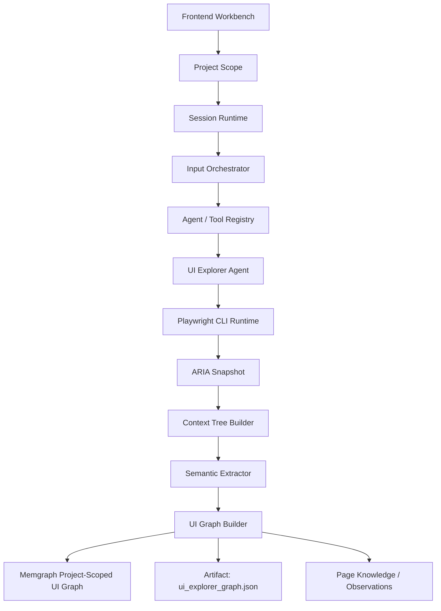

# Enterprise AI QA Agent

## UI Explorer Agent 新架构

当前 UI 方向已经从“UI 测试执行器”收敛为“页面结构理解引擎”：



核心约束：
- 主数据源是 Playwright `aria_snapshot()`，不是 DOM 扁平扫描。
- `ui-page-explorer` 只探索和建模，输出 `pages / elements / entities / edges`。
- 不走 `Verification Harness` 和 `Evaluation Harness`，不生成测试用例、不做断言、不判定通过失败。
- Memgraph 图谱节点主要包括 `Page`、`Element`、`Entity`。
- Memgraph 图谱关系主要包括 `CONTAINS`、`BELONGS_TO`、`TRIGGERS_NAVIGATION`、`REVEALS`。

登录与交互探索：
- 登录不是固定流程；Explorer 只有在检测到可见 password input / 登录表单后，才会使用调用方提供的 `login_credentials`。
- `max_interactions` 用于受控点击非导航控件，采集弹窗、抽屉、Tab、展开区等动态 UI 状态。
- 动态状态会写入 `element_reveals_element` 关系，用于表达“哪个控件揭示了哪些 UI 元素”。

大模型的角色：
- 决定探索策略：根据目标、项目上下文、历史图谱选择是否提供登录凭据、探索深度、交互预算。
- 做语义解释：对 ARIA 事实结果进行业务命名、实体归并、页面意图总结和图谱去重建议。
- 不作为事实源：页面结构、可见性、链接、交互结果必须来自 Playwright / ARIA snapshot / Memgraph 图谱证据。
- 不硬编码流程：登录、点击和导航由 Harness 的检测与策略约束执行，大模型只提出可审计的探索意图。

`Enterprise_AI_QA_Agent` 是一个面向企业级质量保障场景的 Agent 工作台项目，目标是参考 `claude_code_ui_Agent` 的运行骨架，构建一个可扩展的：

- 多 Agent 编排系统
- 可观测的前后端工作台
- 支持流式输出、审批、工具调度、知识检索的 QA 平台

当前项目分为两个核心子工程：

- `Agent_Server`：基于 `FastAPI + LangGraph` 的后端运行时与编排服务
- `agent_web`：基于 `Vue 3 + Vite` 的前端工作台

同时，`docs/` 目录包含本项目后续开发必须遵循的规范文档。

## 核心文档

开始开发前，建议先阅读以下两份文档：

- [Claude_Code_UI_Agent_全流程复刻规范.md](./docs/Claude_Code_UI_Agent_全流程复刻规范.md)
- [HARNESS_ENGINEERING_开发规范.md](./docs/HARNESS_ENGINEERING_开发规范.md)

这两份文档定义了本项目的核心工程方向：

- 不是只做聊天页面，而是做完整的 Agent 运行骨架
- 前端必须具备运行时可观测性
- 后端必须具备会话、事件、快照、审批、调度与恢复能力
- 所有 Agent / Tool / Runtime 扩展都应走统一协议

## 项目结构

```text
Enterprise_AI_QA_Agent/
├─ Agent_Server/      # FastAPI + LangGraph 后端
├─ agent_web/         # Vue 3 + Vite 前端工作台
├─ docs/              # 规范、设计说明与复刻文档
└─ README.md
```

## 当前能力概览

### 后端

- 会话创建、读取、消息发送
- Agent / Tool 注册中心
- LangGraph 编排链路
- SSE 事件流输出
- Tool 审批与恢复接口
- 子代理调度基础能力
- 运行时状态存储与事件回放基础设施

### 前端

- 会话工作台首页
- 流式消息渲染
- 运行状态指示
- 审批面板
- Runtime Event Console
- 系统健康状态展示

## 快速启动

### 1. 启动后端

```bash
cd Agent_Server
uvicorn src.main:app --reload --port 8000
```

说明：

- 默认前端通过代理访问 `http://127.0.0.1:8000`
- 如需环境变量，可参考 `Agent_Server/.env.example`

### 2. 启动前端

```bash
cd agent_web
npm install
npm run dev
```

默认开发地址：

- 前端：`http://localhost:5175`
- 后端代理目标：`http://127.0.0.1:8000`

## 设计映射

项目当前遵循“注册中心 + 图编排 + 工作台 UI”的三层思路：

1. `registry`
   统一管理 Agent、Tool、模型等元数据注册，后续新增能力优先接入这里。

2. `graph`
   使用 LangGraph 组织运行链路，逐步沉淀可恢复、可审批、可中断、可重放的执行状态机。

3. `ui + api`
   前端不是单纯聊天页，而是工作台；后端不是单一 `/chat` 接口，而是 session shell、event stream、approval、dispatch 的统一运行接口。

## 后端 application 分层

`Agent_Server/src/application` 已按职责拆分为子包，避免所有服务文件堆在同一层：

```text
application/
├─ artifacts/       # Artifact 存储与对象存储适配
├─ context/         # Memory、MCP、Observation、Transcript Hygiene
├─ model_adapters/  # OpenAI/Anthropic/Gemini 等模型 provider adapter
├─ models/          # 模型运行时与模型兼容性
├─ orchestration/   # 输入编排、Coordinator/Worker 调度
├─ permissions/     # 工具权限策略与审批请求
├─ prompting/       # Prompt submit 与结构化 prompt 组装
├─ registries/      # Registry 聚合查询服务
├─ runtime/         # LangGraph turn runtime、工具运行时、工具任务
├─ sessions/        # 会话用例服务
├─ settings/        # 模型/邮件等系统配置服务
├─ skills/          # Skill 运行、管理与 marketplace
└─ testing/         # QA 方向识别、测试路由、验证与 UI 探索
```

原 `test_direction_service.py` 与 `test_router_service.py` 并不是测试用例文件，它们实际参与输入编排；现已改为 `testing/direction_service.py` 与 `testing/router_service.py`，并使用 `QATaskDirectionService` / `QATaskRouterService` 命名。

## 适合继续扩展的方向

- 接入 Playwright / Selenium / Browser Agent
- 接入知识库与 RAG 检索
- 扩展任务池、报告中心、配置中心
- 将内存态运行存储替换为数据库或缓存
- 增加更多可注册 Agent 与 Tool

## 开发建议

- 前端改动优先围绕 `session / event / approval / runtime status` 展开
- 后端扩展优先走 `registry + graph + runtime` 这条主线
- 避免把业务逻辑直接写死在页面或单个节点中
- 新增能力前，优先确认是否符合 `Harness Engineering` 约束

## 备注

如果你要继续推进这个项目，推荐顺序是：

1. 巩固 `session + event + snapshot + approval` 基础协议
2. 完善前端工作台可观测性
3. 接入真实执行型 Agent
4. 再逐步扩展知识库、报告、任务池等业务模块
