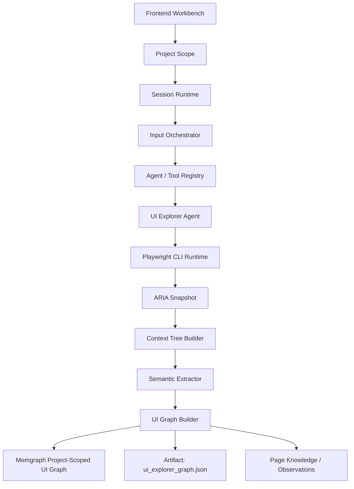

# Enterprise AI QA Agent（御策天检）

`Enterprise_AI_QA_Agent` 是一个面向企业级质量保障场景的多 Agent 编排工作台，目标是参考 `claude_code_ui_Agent` 的运行骨架，构建一个可扩展的：

- 多 Agent 编排系统（Coordinator / Worker 子代理调度）
- 可观测的前后端工作台（会话、事件流、审批、回放）
- 覆盖 API / 性能 / 安全 / 兼容性 / UI 等多方向的 AI 测试平台

当前项目分为两个核心子工程：

- `Agent_Server`：基于 `FastAPI + LangGraph` 的后端运行时与编排服务
- `agent_web`：基于 `Vue 3 + Vite + Naive UI` 的前端工作台（支持 Electron 桌面端打包）

## 项目结构

```text
Enterprise_AI_QA_Agent/
├─ Agent_Server/          # FastAPI + LangGraph 后端
│  ├─ src/
│  │  ├─ main.py          # 应用入口：lifespan 启动流程 + 路由注册
│  │  ├─ api/routes/      # 21 组 REST/SSE 路由（前缀 /api/v1）
│  │  ├─ application/     # 应用服务层（按职责拆分为 36 个子包）
│  │  ├─ modes/           # 14 种测试模式（8 种实装 + 6 种占位）
│  │  ├─ SKILLS/          # 54 个可注册技能包
│  │  ├─ registry/        # Agent / Tool / Model / Skill / MCP / Mode 注册中心
│  │  ├─ core/            # Settings：.env 加载、端口/存储/表名等全部配置
│  │  ├─ contracts/       # 跨层契约定义
│  │  ├─ graph/           # LangGraph 编排链路
│  │  ├─ runtime/         # 运行时状态、事件、快照
│  │  ├─ infrastructure/  # Postgres / MySQL / Memgraph / Redis / RustFS 适配
│  │  ├─ domain/          # 领域模型
│  │  └─ schemas/         # Pydantic 契约
│  ├─ tests/              # pytest 单元与集成测试
│  └─ docs/               # 性能 / 安全测试模式设计文档
├─ agent_web/              # Vue 3 + Vite 前端工作台
│  ├─ src/views/           # 9 个页面：工作台 / 任务池 / 项目 / 知识 / 工具 / 报告 / 设置 / 编排轨迹 / 录制窗口
│  ├─ src/features/        # 插件化功能面板：workbench / flow / recorder / settings / tools
│  ├─ electron/            # Electron 桌面端入口
│  └─ docs/                # VitePress 文档站
├─ databases/              # MySQL 与 PostgreSQL 初始化脚本
├─ docs/                   # 工程规范、复刻文档与开发计划
└─ README.md
```

## 核心文档

开始开发前，建议先阅读以下两份文档：

- [Claude_Code_UI_Agent_全流程复刻规范.md](./docs/Claude_Code_UI_Agent_全流程复刻规范.md)
- [HARNESS_ENGINEERING_开发规范.md](./docs/HARNESS_ENGINEERING_开发规范.md)

这两份文档定义了本项目的核心工程方向：

- 不是只做聊天页面，而是做完整的 Agent 运行骨架
- 前端必须具备运行时可观测性
- 后端必须具备会话、事件、快照、审批、调度与恢复能力
- 所有 Agent / Tool / Runtime 扩展都应走统一协议

## 当前能力概览

### 后端

- 会话创建、读取、消息发送、无头执行（headless execute）
- Agent / Tool / Model / Skill / MCP / Mode 六大注册中心
- LangGraph 编排链路，支持 interrupt / resume 审批中断与恢复
- SSE 事件流输出与事件历史回放（replay）
- Coordinator / Worker 子代理调度
- 工具作业（tool jobs）、产物（artifacts）管理与 RustFS 对象存储
- MCP 连接管理与工具桥接（stdio 命令白名单）
- 向量记忆（pgvector）与 Memgraph 知识图谱 / UI 图谱
- 模型多 Provider 适配（OpenAI / Anthropic / Gemini 等）与 OAuth 授权
- 邮件能力（agently-mail，含腾讯邮箱认证监控）与渠道配对网关（`qq` / `feishu` / `weixin`）
- Docker 容器管理（Redis / RustFS / MySQL / Postgres / Memgraph / 测试引擎）
- **UI 录制链路**：三种浏览器驱动（embedded / cdp-attach / playwright-managed）+ 共用注入脚本 `recorder.js`，事件流幂等落 PostgreSQL、固化成 Memgraph 子图，再经七级定位链回放、转用例草稿、生成置信度分级断言
- **用例驱动治理**：项目（projects）→ 用例草稿/评审/固定版本（test_cases）→ 套件冻结（test_suites）→ 运行条目原子领取与结果入库（test_runs）
- 上传安全扫描（RustFS temp / safe / quarantine 三桶）与安全漏洞台账（`agent_security_bugs`，含复现包与重测）
- 赞助商只读接口（MySQL `system_sponsor_config` → `GET /api/v1/sponsors`）

### 前端

- 会话工作台首页：流式消息渲染、运行状态指示、审批面板、Runtime Event Console
- 任务池、项目、报告中心、知识图谱、工具中心页面
- 编排轨迹（Flow）视图：按会话事件动态生成轨迹节点，支持长文本折叠与下钻
- UI 录制窗口（`RecorderWindowView` + Electron `recorder-window.mjs`）：控制条四按钮状态机、实时时间线
- 插件化设置中心：模型、邮箱、渠道、Docker、存储、平台等
- 顶栏赞助商轮播入口 + 列表弹窗
- 多语言（15 种 locale）
- Electron 桌面端打包（Windows，产物为「御策天检.exe」）
- VitePress 文档站（`npm run dev` 时随应用一起启动）

## 测试模式（modes）

`Agent_Server/src/modes` 下按模式拆分编排实现，`registry/modes.py` 共注册 **14 种**：**8 种已实装**（有专用 Runner 与完整链路），**6 种为占位模式**（manifest 标 `"placeholder": True`，只注册 Skills、`harness_key=placeholder_testing_harness`、`activation_policy=explicit_only`，**没有专用执行链路**）。

### 已实装（8）

| 模式 | key | 说明 |
| --- | --- | --- |
| `api_testing_mode` | `api_testing` | 最完整链路：API 文档解析 → 端点圈定 → 依赖规划 → 前置条件解析 → 执行 → 验证/评估 → 报告，含子代理协调与任务池 |
| `performance_testing_mode` | `performance_testing` | 需求接入 → 负载建模 → k6 / JMeter 引擎执行 → 结果解析 → 失败分析 → 报告，含目标保护（allowlist、VU/RPS/时长上限、smoke 前置） |
| `security_testing_mode` | `security_testing` | 基于 Docker（Kali）运行器的安全测试编排，含攻击链循环与漏洞落库（`agent_security_bugs`） |
| `ui_automation_mode` | `ui_automation` | UI 自动化（Playwright CLI Runtime），并挂接 UI 录制编排（三源检索→审批→录制）与回放执行器 |
| `smoke_testing_mode` | `smoke_testing` | 冒烟测试（方案目录 / 版本 / 运行历史 / 回归候选四表） |
| `compatibility_testing_mode` | `compatibility_testing` | 产品探查 → 环境矩阵 → 用例生成 → 审批策略 → 运行器分发 → 结果聚合 → 报告 |
| `code_review_mode` | `code_review` | 多角色"辩论"式代码评审：源码获取 → 团队组建 → 编排辩论 → 评估 → 验证（含治理规则） |
| `default_mode` | `default` | 默认对话/兜底模式，非测试类问题也能应答 |

### 占位（6）—— 只注册 Skills，尚无专用 Runner

| 模式 | key | 覆盖方向 |
| --- | --- | --- |
| `integration_testing_mode` | `integration_testing` | 集成与依赖测试（服务契约、真实依赖、网络模拟、数据访问） |
| `unit_component_testing_mode` | `unit_component_testing` | 单元 / 组件测试 |
| `mobile_testing_mode` | `mobile_testing` | 移动端测试 |
| `visual_regression_testing_mode` | `visual_regression_testing` | 视觉回归 |
| `accessibility_testing_mode` | `accessibility_testing` | 无障碍测试 |
| `reliability_testing_mode` | `reliability_testing` | 可靠性与韧性（混沌、故障注入方向） |

## UI Explorer Agent 架构

UI 方向已从「UI 测试执行器」收敛为「页面结构理解引擎」：


```mermaid
flowchart TD
    A["Frontend Workbench"] --> B["Project Scope"]
    B --> C["Session Runtime"]
    C --> D["Input Orchestrator"]
    D --> E["Agent / Tool Registry"]
    E --> F["UI Explorer Agent"]
    F --> G["Playwright CLI Runtime"]
    G --> H["ARIA Snapshot"]
    H --> I["Context Tree Builder"]
    I --> J["Semantic Extractor"]
    J --> K["UI Graph Builder"]
    K --> L["Memgraph Project-Scoped UI Graph"]
    K --> M["Artifact: ui_explorer_graph.json"]
    K --> N["Page Knowledge / Observations"]
```

核心约束：

- 主数据源是 Playwright `aria_snapshot()`，不是 DOM 扁平扫描。
- `ui-page-explorer` 只探索和建模，输出 `pages / elements / entities / edges`。
- 不走 `Verification Harness` 和 `Evaluation Harness`，不生成测试用例、不做断言、不判定通过失败。
- Memgraph 图谱节点主要包括 `Page`、`Element`、`Entity`。
- Memgraph 图谱关系主要包括 `CONTAINS`、`BELONGS_TO`、`TRIGGERS_NAVIGATION`、`REVEALS`。

登录与交互探索：

- 登录不是固定流程；Explorer 只有在检测到可见 password input / 登录表单后，才会使用调用方提供的 `login_credentials`。
- `max_interactions` 用于受控点击非导航控件，采集弹窗、抽屉、Tab、展开区等动态 UI 状态。
- 动态状态会写入 `element_reveals_element` 关系，用于表达“哪个控件揭示了哪些 UI 元素”。

大模型的角色：

- 决定探索策略：根据目标、项目上下文、历史图谱选择是否提供登录凭据、探索深度、交互预算。
- 做语义解释：对 ARIA 事实结果进行业务命名、实体归并、页面意图总结和图谱去重建议。
- 不作为事实源：页面结构、可见性、链接、交互结果必须来自 Playwright / ARIA snapshot / Memgraph 图谱证据。
- 不硬编码流程：登录、点击和导航由 Harness 的检测与策略约束执行，大模型只提出可审计的探索意图。

## 技术栈与依赖

### 后端（Python >= 3.11）

FastAPI、Uvicorn、LangGraph、Pydantic v2、SQLAlchemy、psycopg（PostgreSQL）、PyMySQL、neo4j 驱动（Memgraph）、Redis、RustFS（通过 boto3 S3 客户端）、MCP SDK、cryptography。详见 `Agent_Server/pyproject.toml`。

### 前端

Vue 3、Vite 6、Naive UI、Pinia、Vue Router、TypeScript、Electron 31、VitePress。详见 `agent_web/package.json`。

### 存储

| 存储 | 用途 |
| --- | --- |
| PostgreSQL | 运行时数据：`agent_sessions` / `agent_session_messages` / `agent_session_events` / `agent_session_snapshots` / `agent_session_approvals` / `agent_session_resources` / `agent_tool_jobs` / `agent_tool_artifacts` / `agent_memories`（pgvector 向量记忆）/ `agent_mcp_servers` / `agent_projects` / `agent_api_docs` / `agent_security_bugs` / `agent_perf_runs`；冒烟四表 `agent_smoke_plan_catalog` / `_plan_versions` / `_run_history` / `_regression_candidates`；用例驱动八表 `agent_test_cases` / `_case_versions` / `agent_test_suites` / `_suite_items` / `agent_test_runs` / `_run_items` / `_run_attempts` / `_case_results`；录制两表 `ui_recording` / `ui_recording_event` |
| MySQL | 配置数据：`llm_model_config`、`system_email_config`、`system_channel_config`、`system_sponsor_config` |
| Memgraph | 知识图谱、项目级 UI 图谱（`Page` / `Element` / `Entity`）、录制子图（`Recording` / `Action`） |
| Redis | 分布式锁（如邮箱认证锁） |
| RustFS | 产物对象存储与上传安全扫描桶（temp / safe / quarantine） |

初始化脚本位于 `databases/` 目录（`1、MySQL/QA_Agent.sql`、`2、PSQL/public.sql`）。上述表名都可通过 `Agent_Server/.env` 的 Settings 项覆盖。

> **注意**：`databases/2、PSQL/public.sql` 只建 17 张表（会话族、tool jobs/artifacts、memories、mcp_servers、perf_runs、冒烟四表、录制两表），**不含** `agent_projects`、`agent_api_docs`、`agent_security_bugs` 与用例驱动八表。这些表由对应 store（`application/projects/project_store.py`、`application/documents/api_doc_store.py`、`modes/security_testing_mode/security_bug_store.py`、`application/test_{cases,suites,runs}/*_store.py` 等 19 处）在启动或首次使用时 `CREATE TABLE IF NOT EXISTS` 自建。所以"跑完 SQL 脚本就以为建全了"是错的；反过来，只想手工核对结构时也要以代码里的建表语句为准。

## 快速启动

### 0. 准备环境

复制 `Agent_Server/.env.example` 为 `Agent_Server/.env`，按需配置 MySQL / PostgreSQL / Memgraph / Redis / RustFS 连接信息。基础设施容器也可通过设置页的 Docker 管理面板一键拉起。

### 1. 启动后端

```bash
cd Agent_Server
uvicorn src.main:app --reload --port 1032
```

说明：

- 前端开发代理默认指向 `http://127.0.0.1:1032`（可用 `VITE_API_PROXY_TARGET` 覆盖）
- API 统一前缀为 `/api/v1`，健康检查见 `/api/v1/health`

### 2. 启动前端

```bash
cd agent_web
npm install
npm run dev        # 同时启动应用（5175）与 VitePress 文档站
npm run dev:app    # 只启动应用
```

默认开发地址：

- 前端：`http://localhost:5175`
- 后端代理目标：`http://127.0.0.1:1032`

### 3. 桌面端（可选）

```bash
cd agent_web
npm run desktop        # 本地运行 Electron 桌面端
npm run desktop:pack   # 打包 Windows 桌面安装目录
```

## API 路由概览

后端在 `src/main.py` 中注册 **21 组**路由（统一前缀 `/api/v1`）：

| 路由 | 职责 |
| --- | --- |
| `sessions` | 会话 CRUD、消息发送、SSE 事件流、事件历史、快照、interrupt / resume 审批、replay 回放、tool-jobs、artifacts、无头执行 |
| `registry` | Agent / Tool / Model / Skill / MCP / Mode 注册中心查询 |
| `projects` | 项目 CRUD 与项目总览（`/projects/{id}/overview`）、历史冒烟运行归集 |
| `case_management` | 用例驱动链路：草稿列表 / 详情 / 版本、`submit-review`、`activate`（启用固定版本）、`archive` |
| `suite_management` | 套件与冻结版本：`/projects/{id}/suites`、套件详情、归档 |
| `run_management` | 运行与运行条目：`/projects/{id}/runs`、`runs/{id}/claim` 原子领取、`run-items/{id}` 的 start / heartbeat / complete |
| `security_bugs` | 安全漏洞列表 / 详情 / 复现包下载 / `retest` 重测 / 状态修改 |
| `recordings` | UI 录制：会话创建·列表·详情·删除、`attach-registry`、`events:batch` 幂等上报、`commands` long-poll、`screenshots` multipart、`control` 指令、`graph` 子图投影、`recorder.js` 下发 |
| `api_docs` | API 文档上传与解析 |
| `attachments` | 附件与上传安全扫描 |
| `reports` | 报告中心 |
| `task_pool` | 任务池 |
| `knowledge` | 知识图谱 |
| `compatibility` | 兼容性测试运行 |
| `integrations` | 集成目录 |
| `settings` | 模型、邮箱、渠道配对、数据导入导出等系统配置 |
| `sponsors` | 赞助商只读列表（`GET /sponsors`，仅返回 enabled 记录） |
| `oauth` | 模型 Provider OAuth 授权（Azure / Google / GitHub / CodeBuddy / TRAE / Codex） |
| `mail` | 邮件能力 |
| `docker` | Docker 容器管理 |
| `health` | 健康检查 |

> 命名注意：`case_management.py` / `suite_management.py` / `run_management.py` 三个模块导出的路由器变量分别是 `test_cases_router` / `test_suites_router` / `test_runs_router`，且它们**不带额外子前缀**，最终路径形如 `/api/v1/test-cases/{case_id}`、`/api/v1/projects/{project_id}/runs`。

## 设计映射

项目当前遵循“注册中心 + 图编排 + 工作台 UI”的三层思路：

1. `registry`
   统一管理 Agent、Tool、模型等元数据注册，后续新增能力优先接入这里。

2. `graph`
   使用 LangGraph 组织运行链路，逐步沉淀可恢复、可审批、可中断、可重放的执行状态机。

3. `ui + api`
   前端不是单纯聊天页，而是工作台；后端不是单一 `/chat` 接口，而是 session shell、event stream、approval、dispatch 的统一运行接口。

## 后端 application 分层

`Agent_Server/src/application` 已按职责拆分为 **36 个子包**，避免所有服务文件堆在同一层：

```text
application/
├─ api_doc_resolution/  # API 文档定位与解析
├─ artifacts/           # Artifact 存储与 RustFS 对象存储适配
├─ capabilities/        # 能力解析与工具暴露策略（capability_resolver / tool_exposure_policy）
├─ compatibility/       # 兼容性 Runner
├─ context/             # Memory、MCP、Observation、Transcript Hygiene
├─ documents/           # API 文档服务
├─ exploration/         # UI 探索支撑、UI 图谱与录制子图写入
├─ flow/                # 编排轨迹投影（前端 Flow 视图的数据来源）
├─ images/              # 镜像目录（测试引擎/环境镜像）
├─ integrations/        # 集成目录服务
├─ intent/              # 意图识别、模式选择策略、安全意图与语义意图
├─ knowledge/           # 知识图谱服务
├─ mail/                # 邮件服务与腾讯邮箱认证监控
├─ mcp/                 # MCP 连接管理、工具桥、服务器存储
├─ model_adapters/      # OpenAI/Anthropic/Gemini 等模型 provider adapter
├─ model_clients/       # 各家模型客户端实现与 Embedding 客户端（embeddings.py）
├─ model_providers/     # Provider 元数据与 OAuth 令牌服务
├─ models/              # 模型运行时与模型兼容性
├─ orchestration/       # 输入编排、Coordinator/Worker 调度
├─ performance/         # k6/JMeter 引擎适配、目标保护、指标存储
├─ permissions/         # 工具权限策略与审批请求
├─ projects/            # 项目总览与历史冒烟运行导入
├─ prompting/           # Prompt submit 与结构化 prompt 组装
├─ recorder/            # UI 录制：assets/recorder.js + drivers（embedded / cdp-attach / playwright-managed）+ 会话编排
├─ registries/          # Registry 聚合查询服务
├─ reporting/           # 报告构建
├─ resources/           # 会话资源与浏览器会话清理
├─ runtime/             # LangGraph turn runtime、工具运行时、工具任务
├─ security/            # 安全测试与上传安全扫描
├─ sessions/            # 会话用例服务
├─ settings/            # 模型/邮件/渠道等系统配置服务
├─ skills/              # Skill 运行、管理与 marketplace
├─ test_cases/          # 用例草稿、评审、启用固定版本
├─ test_runs/           # 运行条目原子领取、心跳与结果入库
├─ test_suites/         # 套件与冻结版本
└─ testing/             # QA 方向识别、测试路由、验证与 UI 探索
```

未进子包的顶层服务另有三个：`docker_management_service.py`、`report_service.py`、`task_pool_service.py`。

原 `test_direction_service.py` 与 `test_router_service.py` 并不是测试用例文件，它们实际参与输入编排；现已改为 `testing/direction_service.py` 与 `testing/router_service.py`，并使用 `QATaskDirectionService` / `QATaskRouterService` 命名。

## 测试

```bash
cd Agent_Server
pip install -e .[dev]      # dev extra 提供 pytest 与 pytest-asyncio
pytest tests               # 92 个测试文件

cd ../agent_web
npm test                   # vitest run（含 tests/recorder/recorder.test.mjs）
npm run build              # vite build（注意：脚本里没有 vue-tsc，类型检查需另行执行）
```

`Agent_Server/tests/` 覆盖性能测试全链路（runner / coordinator / adapter / parser / guard / report）、**UI 录制域**（`recording_store` / `recording_graph_store` / `recordings` 路由 / 契约 schema / 三种 recorder 驱动 / `replay_executor` 纯函数与真实 Chromium live 回放 / P0 端到端串联 / `ui_resource_assessor` / `assertion_suggester`）、邮件、知识图谱、任务池、报告、会话存储、渠道配置等模块。

> 需要真实浏览器的验收用例（`tests/test_replay_live.py`）由 `RUN_LIVE_REPLAY=1` 门控，默认干净跳过而不是失败；要跑真实回放链路请显式设置该变量。

## 当前进度与下一步

已完成并带测试的骨架：`session + event + snapshot + approval` 协议、LangGraph 编排与 interrupt/resume、Coordinator/Worker 调度、8 种实装测试模式（另有 6 种占位待补 Runner）、54 个 Skill、前端工作台可观测性、知识图谱与 pgvector 记忆、用例驱动八表、UI 录制 P0~P2（契约/存储/注入脚本/三种驱动/固化/审批编排/API/桌面端窗口/回放执行器/录制转草稿/断言建议）。

接下来真正欠的：

1. **录制域收口**：手工 GUI 验收（`docs/ui_recording_progress.md` 已列出无法自动化的项）；回放执行器与真实业务页面的定位退化数据回流
2. **P3 ego-lite 驱动 ⛔ 阻塞**：依赖方 ego-lite 目前仅提供 macOS 实现，当前 Windows/Linux 环境无法推进，需要先决定替代方案或等上游
3. **安全测试闭环**：攻击链与漏洞台账已有，但实验/验证与复现包质量仍缺一轮真实目标回归
4. **6 个占位模式补专用 Runner**：`integration_testing` / `unit_component_testing` / `mobile_testing` / `visual_regression_testing` / `accessibility_testing` / `reliability_testing` 目前只注册 Skills，需要各自的 harness 与执行链路才能从"占位"转"实装"
5. **前端类型检查**：`npm run build` 只有 `vite build`，未接 `vue-tsc`，类型回归目前靠人工

> 文档口径已于 2026-08-30 与代码对齐：`docs/` 下进度与方案文档里的 MinIO 已统一改为 RustFS，`recordings` 端点数改为按装饰器实测的 11，`docker compose up -d` 这类项目内并不存在的步骤已换成设置页 Docker 面板。后续改代码请同步这几份文档。

## 开发建议

- 前端改动优先围绕 `session / event / approval / runtime status` 展开
- 后端扩展优先走 `registry + graph + runtime` 这条主线
- 避免把业务逻辑直接写死在页面或单个节点中
- 新增能力前，优先确认是否符合 `Harness Engineering` 约束
- 跨边界契约（路由、Pydantic 契约、事件名、表名、Settings 配置项）改动必须同步所有消费方，含 `agent_web/src/services/api.ts`、i18n 与本文档
