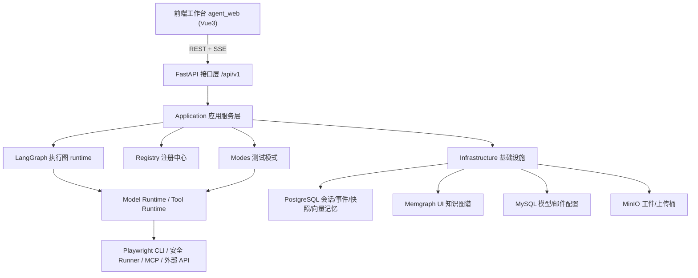

## 2. 整体架构

### 2.1 技术栈

| 层 | 技术 |
|----|------|
| 后端运行时 | FastAPI、LangGraph、Pydantic v2、pydantic-settings |
| 模型适配 | OpenAI Chat、Anthropic Messages、Google Gemini provider adapter + OAuth2 |
| 前端工作台 | Vue 3、Vite、Pinia、Vue Router、Naive UI |
| 关系/向量存储 | PostgreSQL（会话、事件、快照、审批、工具任务、向量记忆） |
| 图数据库 | Memgraph（页面知识图谱，bolt 协议） |
| 元数据存储 | MySQL（模型配置、邮件配置） |
| 对象存储 | MinIO（工件、上传文件三段式安全桶） |
| 浏览器执行 | Python Playwright CLI 运行时 |
| 安全执行 | 本地 / Docker（Kali）沙箱 |

### 2.2 分层视图



### 2.3 后端目录职责

```text
Agent_Server/src/
├─ main.py            # 应用入口：装配所有服务、注册路由、lifespan 依赖注入
├─ api/routes/        # FastAPI 路由层（health/sessions/registry/settings/...）
├─ application/       # 应用服务层（按职责拆分子包，见下）
├─ graph/             # LangGraph 执行图：builder + state + nodes
├─ modes/             # 各测试模式（manifest + agent + tools + 专属逻辑）
├─ registry/          # Agent/Tool/Model/Mode/Skill/MCP 注册中心
├─ runtime/           # 会话存储、控制、流式、工具任务存储
├─ infrastructure/    # PostgreSQL/Memgraph/MySQL/MinIO 等基础设施适配
├─ schemas/           # Pydantic 请求/响应/领域 Schema
├─ domain/            # 领域模型
├─ contracts/         # 抽象接口（如 memory_store）
├─ core/              # 全局配置 config.py
├─ SKILLS/            # 技能文件（SKILL.md）
├─ templates/         # 报告/邮件 HTML 模板
└─ data/              # 本地数据（api_docs、integrations、artifacts、general_settings）
```

`application/` 子包：

```text
application/
├─ artifacts/       # 工件存储与对象存储适配
├─ context/         # Memory、MCP、Observation、Transcript Hygiene 运行时
├─ documents/       # API 文档库服务
├─ exploration/     # UI 图谱存储
├─ integrations/    # 外部集成目录服务
├─ knowledge/       # 知识图谱服务
├─ mcp/             # MCP 客户端、管理、provider 注册、运行时
├─ model_adapters/  # OpenAI/Anthropic/Gemini adapter 注册
├─ model_providers/ # provider profile 与流程存储
├─ models/          # 模型运行时、模型兼容性、OAuth token
├─ orchestration/   # 输入编排、Coordinator/Worker 调度
├─ permissions/     # 工具权限策略与审批
├─ prompting/       # Prompt 提交与结构化组装
├─ registries/      # 注册中心聚合查询
├─ reporting/       # 报告模板
├─ runtime/         # LangGraph turn runtime、工具运行时、工具任务、Playwright CLI
├─ security/        # 安全执行环境、命令画像、风险策略、上传安全
├─ sessions/        # 会话用例服务
├─ settings/        # 模型/邮件等系统配置服务
├─ skills/          # Skill 运行、管理、marketplace
└─ testing/         # QA 方向识别、测试路由、验证、UI 探索
```

### 2.4 前端目录职责

```text
agent_web/src/
├─ main.ts            # 入口：挂载 Pinia/Router/i18n，注册 Service Worker
├─ App.vue            # 应用骨架：侧边栏 + 顶栏 + 路由视图 + 运行时控制台
├─ router/            # 路由表
├─ views/             # 页面视图（Workbench/TaskPool/Knowledge/Tools/Reports/Settings）
├─ components/
│  ├─ layout/         # AppSidebar / AppTopBar
│  └─ chat/           # 审批、时间线、事件控制台、工具活动、快照、验证等面板
├─ features/          # settings / tools 的插件式子模块
├─ stores/            # Pinia store（app / session / generalSettings）
├─ services/          # api 封装、i18n、桌面通知
├─ locales/           # 15 种语言包
├─ types/             # 类型定义
└─ utils/             # 工具函数
```

---
