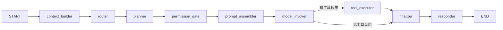

## 4. 核心概念

### 4.1 会话（Session）

会话是一切执行的载体。关键字段：

| 字段 | 含义 |
|------|------|
| `id` | 会话唯一标识 |
| `status` | 状态：idle / running / waiting_approval / interrupted / completed / failed |
| `session_mode` | 会话类型：chat / background_task 等 |
| `runtime_mode` | 运行模式：auto 等 |
| `mode_key` | 测试模式 key（default / ui_automation / api_testing / ...） |
| `preferred_model` | 偏好模型 |
| `selected_agent` | 选定 Agent |
| `messages` | 消息链 |
| `event_count` / `snapshot_count` | 事件数 / 快照数 |

### 4.2 轮次（Turn）与执行循环

一次用户输入触发一个 turn，turn 内部是一条**状态驱动的多轮执行循环**：模型输出 → 工具调用 → 结果回注 → 下一轮，直到满足终止条件（`runtime_max_iterations` 默认 8）。

### 4.3 LangGraph 执行图

后端用 LangGraph 把单个 turn 编排为有向图（`src/graph/builder.py`）：

各节点职责：

| 节点 | 职责 |
|------|------|
| `context_builder` | 装配上下文：记忆检索、观察记录等 |
| `router` | 根据模式/意图选择 Agent、模型、技能、可用工具、MCP |
| `planner` | 生成执行计划步骤 |
| `permission_gate` | 计算工具权限：allow / ask / deny |
| `prompt_assembler` | 结构化组装 system prompt 与运行时消息 |
| `model_invoker` | 调用模型，产出文本或工具调用 |
| `tool_executor` | 执行工具调用并回注结果（受审批约束） |
| `finalizer` | 收敛本轮结果，决定是否继续循环 |
| `responder` | 生成最终响应 |

执行状态结构见 `src/graph/state.py` 的 `AgentGraphState`（包含 trace_id、turn_id、技能、记忆、工具权限、审批、计划、工具结果、控制态、循环计数等）。

### 4.4 权限与审批

工具按权限级别分类：

- **safe**：直接执行（如知识检索、读取历史）。
- **ask**：需人工审批后才执行（如终端命令、浏览器操作、外部 API、发送消息、文件访问）。

审批在前端「权限审批」面板处理，决策结果会结构化记录并驱动 turn 继续或终止。

### 4.5 快照与回放

每个执行阶段会落 snapshot（含 graph_state、stage、version、trace_id）。会话支持 `/replay` 回放，前端「快照追踪」「事件控制台」可查看历史轨迹。

### 4.6 工件（Artifact）与工具任务（Tool Job）

- **Tool Job**：一次真实的工具执行任务，含状态机（queued / running / waiting_approval / completed / partial / failed / denied / cancelled 等）。
- **Artifact**：执行产出的文件（截图、trace、日志、报告），落 MinIO 并在前端「工具任务」「工具活动」面板可见。

---
