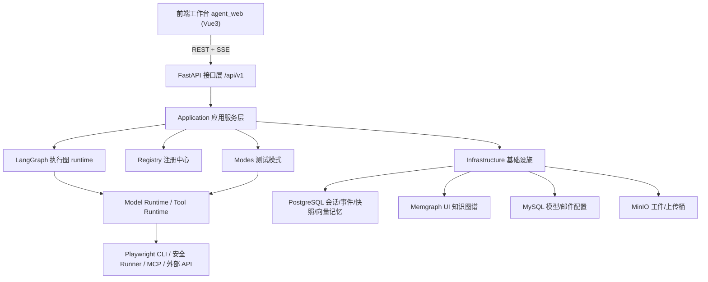
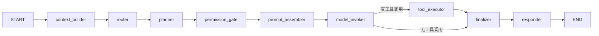

# Enterprise AI QA Agent · 系统使用与开发手册

> 版本：v1.0  
> 适用对象：QA 工程师、平台使用者、前后端开发者、运维人员  
> 定位：本手册是面向「御策天检」(Enterprise AI QA Agent) 的全方位使用与开发文档，覆盖系统定位、架构、功能模块、运行部署、配置、API、二次开发与排障。

---

## 目录

1. [系统概述](#1-系统概述)
2. [整体架构](#2-整体架构)
3. [快速开始](#3-快速开始)
4. [核心概念](#4-核心概念)
5. [测试模式详解](#5-测试模式详解)
6. [前端工作台使用指南](#6-前端工作台使用指南)
7. [后端服务与运行时](#7-后端服务与运行时)
8. [Agent / Tool / Skill / MCP 能力体系](#8-agent--tool--skill--mcp-能力体系)
9. [配置参考](#9-配置参考)
10. [REST API 参考](#10-rest-api-参考)
11. [数据与存储](#11-数据与存储)
12. [二次开发指南](#12-二次开发指南)
13. [Harness 工程规范](#13-harness-工程规范)
14. [常见问题与排障](#14-常见问题与排障)
15. [术语表](#15-术语表)

---

## 1. 系统概述

### 1.1 这是什么

`Enterprise AI QA Agent`（界面代号「御策天检」）是一套面向**企业级质量保障场景**的 AI Agent 工作台。它不是单纯的聊天机器人，而是一个具备完整运行骨架的 **多 Agent 编排平台**：用户用自然语言下达测试意图，系统负责意图分析、能力路由、工具调度、权限审批、证据采集、验证评估与报告交付。

### 1.2 核心特征

- **多 Agent 编排**：以 Coordinator 为核心，按场景路由到不同的专属 Agent 与 Worker。
- **多测试模式**：内置 UI 自动化、API 接口测试、安全测试、代码审批等垂直测试模式。
- **运行时可观测**：会话事件、工具活动、快照追踪、工具任务、验证结果全程可见、可回放。
- **工具权限仲裁**：高风险工具调用（终端命令、浏览器操作、外部请求、文件访问、消息发送）需经人工审批。
- **可恢复 / 可中断**：长任务支持中断、恢复、回放，关键状态结构化落库。
- **知识沉淀**：UI 探索结果以页面知识图谱形式存入 Memgraph，向量记忆存入 PostgreSQL。
- **能力可扩展**：Agent、Tool、Skill、Mode、MCP、模型 Provider 均走统一注册协议。

### 1.3 子工程结构

```text
Enterprise_AI_QA_Agent/
├─ Agent_Server/      # FastAPI + LangGraph 后端运行时与编排服务
├─ agent_web/         # Vue 3 + Vite 前端工作台
├─ docs/              # 规范、设计说明、复刻文档、本手册
├─ reports/           # 运行产出报告目录
├─ scripts/           # 顶层脚本（如全流程测试）
└─ README.md
```

---

## 2. 整体架构

### 2.1 技术栈

| 层 | 技术 |
|----|------|
| 后端运行时 | FastAPI、LangGraph、Pydantic v2、pydantic-settings |
| 模型适配 | OpenAI Chat、Anthropic Messages、Google Gemini provider adapter + OAuth2 |
| 前端工作台 | Vue 3、Vite、Pinia、Vue Router、Naive UI |
| 关系/向量存储 | PostgreSQL（会话、事件、快照、审批、工具任务、向量记忆） |
| 图数据库 | Memgraph（页面知识图谱，bolt 协议） |
| 元数据存储 | MySQL（模型配置、邮件配置） |
| 对象存储 | MinIO（工件、上传文件三段式安全桶） |
| 浏览器执行 | Python Playwright CLI 运行时 |
| 安全执行 | 本地 / Docker（Kali）沙箱 |

### 2.2 分层视图



### 2.3 后端目录职责

```text
Agent_Server/src/
├─ main.py            # 应用入口：装配所有服务、注册路由、lifespan 依赖注入
├─ api/routes/        # FastAPI 路由层（health/sessions/registry/settings/...）
├─ application/       # 应用服务层（按职责拆分子包，见下）
├─ graph/             # LangGraph 执行图：builder + state + nodes
├─ modes/             # 各测试模式（manifest + agent + tools + 专属逻辑）
├─ registry/          # Agent/Tool/Model/Mode/Skill/MCP 注册中心
├─ runtime/           # 会话存储、控制、流式、工具任务存储
├─ infrastructure/    # PostgreSQL/Memgraph/MySQL/MinIO 等基础设施适配
├─ schemas/           # Pydantic 请求/响应/领域 Schema
├─ domain/            # 领域模型
├─ contracts/         # 抽象接口（如 memory_store）
├─ core/              # 全局配置 config.py
├─ SKILLS/            # 技能文件（SKILL.md）
├─ templates/         # 报告/邮件 HTML 模板
└─ data/              # 本地数据（api_docs、integrations、artifacts、general_settings）
```

`application/` 子包：

```text
application/
├─ artifacts/       # 工件存储与对象存储适配
├─ context/         # Memory、MCP、Observation、Transcript Hygiene 运行时
├─ documents/       # API 文档库服务
├─ exploration/     # UI 图谱存储
├─ integrations/    # 外部集成目录服务
├─ knowledge/       # 知识图谱服务
├─ mcp/             # MCP 客户端、管理、provider 注册、运行时
├─ model_adapters/  # OpenAI/Anthropic/Gemini adapter 注册
├─ model_providers/ # provider profile 与流程存储
├─ models/          # 模型运行时、模型兼容性、OAuth token
├─ orchestration/   # 输入编排、Coordinator/Worker 调度
├─ permissions/     # 工具权限策略与审批
├─ prompting/       # Prompt 提交与结构化组装
├─ registries/      # 注册中心聚合查询
├─ reporting/       # 报告模板
├─ runtime/         # LangGraph turn runtime、工具运行时、工具任务、Playwright CLI
├─ security/        # 安全执行环境、命令画像、风险策略、上传安全
├─ sessions/        # 会话用例服务
├─ settings/        # 模型/邮件等系统配置服务
├─ skills/          # Skill 运行、管理、marketplace
└─ testing/         # QA 方向识别、测试路由、验证、UI 探索
```

### 2.4 前端目录职责

```text
agent_web/src/
├─ main.ts            # 入口：挂载 Pinia/Router/i18n，注册 Service Worker
├─ App.vue            # 应用骨架：侧边栏 + 顶栏 + 路由视图 + 运行时控制台
├─ router/            # 路由表
├─ views/             # 页面视图（Workbench/TaskPool/Knowledge/Tools/Reports/Settings）
├─ components/
│  ├─ layout/         # AppSidebar / AppTopBar
│  └─ chat/           # 审批、时间线、事件控制台、工具活动、快照、验证等面板
├─ features/          # settings / tools 的插件式子模块
├─ stores/            # Pinia store（app / session / generalSettings）
├─ services/          # api 封装、i18n、桌面通知
├─ locales/           # 15 种语言包
├─ types/             # 类型定义
└─ utils/             # 工具函数
```

---

## 3. 快速开始

### 3.1 环境要求

- Python ≥ 3.11
- Node.js ≥ 18（建议 20+）
- PostgreSQL（含向量扩展，用于会话与记忆）
- MySQL（模型/邮件配置，默认端口 3307）
- Memgraph（可选，用于 UI 知识图谱，bolt://127.0.0.1:7687）
- MinIO（可选，用于工件与上传文件存储）
- Docker（可选，安全测试模式的 Kali 沙箱）

> 说明：未配置 Memgraph / MinIO 时，对应能力会降级或不可用，但核心会话能力依赖 PostgreSQL。

### 3.2 启动后端

```bash
cd Agent_Server
# 准备环境变量
cp .env.example .env   # Windows: copy .env.example .env
# 安装依赖（任选其一）
pip install -e .
# 或使用 uv
uv pip install -e .

# 启动（开发模式）
uvicorn src.main:app --reload --port 1032
```

- 默认监听 `http://127.0.0.1:1032`
- API 前缀：`/api/v1`
- 健康检查：`GET http://127.0.0.1:1032/api/v1/health`

> `src/main.py` 末尾的 `__main__` 默认使用端口 `1032`；前端开发代理也指向 `1032`（见 `vite.config.ts`）。

### 3.3 启动前端

```bash
cd agent_web
npm install
npm run dev
```

- 默认开发地址：`http://localhost:5175`
- API 代理：`/api` → `http://127.0.0.1:1032`（可用环境变量 `VITE_API_PROXY_TARGET` 覆盖）

构建产物：

```bash
npm run build      # 输出到 dist/
npm run preview    # 本地预览构建产物
```

### 3.4 第一次跑通的建议顺序

1. 启动 PostgreSQL、MySQL（必需），确认连接信息写入 `.env`。
2. 启动后端，访问 `/api/v1/health` 确认 `postgres_ok=true`。
3. 启动前端，打开首页（工作台）。
4. 进入「系统设置 → 模型设置」，添加并激活一个模型配置（API Key 或 OAuth）。
5. 回到首页，输入一条自然语言测试指令，观察运行时控制台事件流。

---

## 4. 核心概念

### 4.1 会话（Session）

会话是一切执行的载体。关键字段：

| 字段 | 含义 |
|------|------|
| `id` | 会话唯一标识 |
| `status` | 状态：idle / running / waiting_approval / interrupted / completed / failed |
| `session_mode` | 会话类型：chat / background_task 等 |
| `runtime_mode` | 运行模式：auto 等 |
| `mode_key` | 测试模式 key（default / ui_automation / api_testing / ...） |
| `preferred_model` | 偏好模型 |
| `selected_agent` | 选定 Agent |
| `messages` | 消息链 |
| `event_count` / `snapshot_count` | 事件数 / 快照数 |

### 4.2 轮次（Turn）与执行循环

一次用户输入触发一个 turn，turn 内部是一条**状态驱动的多轮执行循环**：模型输出 → 工具调用 → 结果回注 → 下一轮，直到满足终止条件（`runtime_max_iterations` 默认 8）。

### 4.3 LangGraph 执行图

后端用 LangGraph 把单个 turn 编排为有向图（`src/graph/builder.py`）：



各节点职责：

| 节点 | 职责 |
|------|------|
| `context_builder` | 装配上下文：记忆检索、观察记录等 |
| `router` | 根据模式/意图选择 Agent、模型、技能、可用工具、MCP |
| `planner` | 生成执行计划步骤 |
| `permission_gate` | 计算工具权限：allow / ask / deny |
| `prompt_assembler` | 结构化组装 system prompt 与运行时消息 |
| `model_invoker` | 调用模型，产出文本或工具调用 |
| `tool_executor` | 执行工具调用并回注结果（受审批约束） |
| `finalizer` | 收敛本轮结果，决定是否继续循环 |
| `responder` | 生成最终响应 |

执行状态结构见 `src/graph/state.py` 的 `AgentGraphState`（包含 trace_id、turn_id、技能、记忆、工具权限、审批、计划、工具结果、控制态、循环计数等）。

### 4.4 权限与审批

工具按权限级别分类：

- **safe**：直接执行（如知识检索、读取历史）。
- **ask**：需人工审批后才执行（如终端命令、浏览器操作、外部 API、发送消息、文件访问）。

审批在前端「权限审批」面板处理，决策结果会结构化记录并驱动 turn 继续或终止。

### 4.5 快照与回放

每个执行阶段会落 snapshot（含 graph_state、stage、version、trace_id）。会话支持 `/replay` 回放，前端「快照追踪」「事件控制台」可查看历史轨迹。

### 4.6 工件（Artifact）与工具任务（Tool Job）

- **Tool Job**：一次真实的工具执行任务，含状态机（queued / running / waiting_approval / completed / partial / failed / denied / cancelled 等）。
- **Artifact**：执行产出的文件（截图、trace、日志、报告），落 MinIO 并在前端「工具任务」「工具活动」面板可见。

---

## 5. 测试模式详解

系统内置 7 个模式（5 个正式 + 2 个占位），由 `ModeRegistry` 统一注册校验。模式在创建会话时通过 `mode_key` 选择。

### 5.1 默认模式（default）

- **定位**：处理测试以外的通用协作、问答、调度与工作台能力。
- **默认 Agent**：`coordinator`
- **能力**：workflow-router、subagent-dispatch、knowledge-rag、attachment-reader、session-history/timeline、observation-search、cli-executor、report-writer、send-email。
- **适用**：通用对话、综合调度、跨能力编排。

### 5.2 UI 自动化模式（ui_automation）

- **定位**：页面结构理解引擎（注意：方向已从「UI 测试执行器」收敛为「页面结构理解 / 探索」）。
- **默认 Agent**：`ui-automation-agent`（探索由 `ui-executor` / UI Explorer 承担）。
- **核心能力**：ui-page-explorer、browser-automation、browser-control、dom-inspector、file-artifact-manager、report-writer。
- **技能**：ui-exploration、playwright-cli、artifact-collection。
- **关键约束**：
  - 主数据源是 Playwright `aria_snapshot()`，**不是 DOM 扁平扫描**。
  - 只探索建模，输出 `pages / elements / entities / edges`，**不生成测试用例、不做断言、不判定通过失败**。
  - 登录非固定流程：仅当检测到可见 password input / 登录表单时，才使用调用方提供的 `login_credentials`。
  - `max_interactions` 用于受控点击非导航控件，采集弹窗、抽屉、Tab、展开区等动态状态，写入 `element_reveals_element` 关系。
  - 探索结果写入 Memgraph 项目级 UI 图谱（节点 `Page`/`Element`/`Entity`，关系 `CONTAINS`/`BELONGS_TO`/`TRIGGERS_NAVIGATION`/`REVEALS`）。

### 5.3 API 接口测试模式（api_testing）

- **定位**：接口校验、契约检查、响应断言与证据沉淀。
- **默认 Agent**：`api-testing-agent`，并含一组 Worker：doc-analyst、suite-planner、precondition-planner、executor-worker、failure-analyst、project-clarifier。
- **核心能力**：api-test-runner、api-docs-library、api-tester、knowledge-rag、report-writer。
- **技能**：api-validation、assertion-design。
- **流程**：文档解析 → 用例规划 → 前置/认证规划 → 多 worker 并行 HTTP 执行 → 失败分析 → 报告。
- **配套**：可通过「工具中心 → API 接口文档」上传/导入 OpenAPI 等文档供测试复用。

### 5.4 安全测试模式（security_testing）

- **定位**：面向 Web/API、主机、端口、网络侦察的多智能体渗透测试。
- **默认 Agent**：`security-testing-agent`，含 recon / auth / web-verifier / api-verifier / host-verifier / exploit-coder / failure-analyst 等 Worker。
- **核心能力**：security-scan-runner、network-recon-runner、web-scan-runner、service-audit-runner、credential-attack-runner、traffic-analysis-runner、exploit-workbench-runner、report-writer、send-email。
- **技能**：vulnerability-analysis、network-reconnaissance。
- **能力链**：资产发现 → 端口扫描 → 服务指纹 → Web 漏洞扫描 → 凭证验证 → 漏洞利用验证 → 结构化报告 + 邮件投递。
- **执行环境**：支持本地或 Docker（默认镜像 `vxcontrol/kali-linux`）沙箱，受 `SECURITY_RUNNER_*` 配置控制。
- ⚠️ **合规提示**：仅可对获得明确授权的目标进行安全测试。

### 5.5 代码审批模式（code_review）

- **定位**：项目级代码审批，辩论式风险识别，输出结构化审批报告。
- **默认 Agent**：`code-review-agent`，含 architecture / correctness / security / testability / maintainability 五维评审员 + synthesizer 总结 Agent。
- **核心能力**：code-review-orchestrator、project-source-loader、project-tree-scanner、project-file-reader、project-diff-reader、cli-executor、report-writer、send-email。
- **特点**：主持人按项目规模与模型上下文分配「辩论时间预算」，多轮立论 → 攻防 → 裁决 → 总结。前端「报告中心」与运行时「审批进程」面板可观测全过程。

### 5.6 占位模式（即将推出）

| 模式 | key | 状态 | 规划方向 |
|------|-----|------|----------|
| 性能测试模式 | `performance_testing` | 占位（placeholder） | 基线测试、吞吐/延迟观察、性能证据输出 |
| 冒烟测试模式 | `smoke_testing` | 占位（placeholder） | 核心链路快速回归与基础可用性确认 |

> 占位模式已完成模式骨架与专属 Agent/工具注册，能力待接入；前端会标注「占位」。

---

## 6. 前端工作台使用指南

### 6.1 导航结构

左侧边栏（`AppSidebar.vue`）入口：

| 入口 | 路由 | 用途 |
|------|------|------|
| 首页 | `/home` | 会话工作台，下达指令、查看消息与运行时控制台 |
| 任务池 | `/taskpool` | 查看后台会话与代码审批任务（待执行/执行中/已完成/失败） |
| 知识库 | `/knowledge` | 浏览项目级 UI 知识图谱（页面/实体/元素/关系） |
| 工具中心 | `/tools` | 管理 Skills、API 文档、安全扫描引擎、后端注册服务、插件接入 |
| 报告中心 | `/reports` | 查看代码审批会话、辩论总结与报告产物 |
| 系统设置 | `/settings` | 通用/模型/邮件/接入/通讯渠道/存储/关于 |

### 6.2 首页工作台

- 输入框支持自然语言指令，Enter 发送、Shift+Enter 换行。
- 支持附件上传（受类型/大小/数量限制）。
- 底部「运行时事件控制台」可展开，提供多标签页：
  - **运行日志**：watcher、approvals、queue、session/agent/messages 状态行。
  - **事件控制台**：会话消息 / 工具消息 / 错误消息、排队轮次、转录、运行事件。
  - **工具活动**：最近一次工具执行（状态、文件产物、指标、trace/approval/job id）。
  - **快照追踪**：trace_id、turn_id、stage、version、控制态、循环、终止态。
  - **工具任务**：持久化的 Tool Job 与文件产物。
  - **验证结果**：从执行证据派生的结构化结论（通过/失败/部分/未执行 + 断言数 + 证据）。
  - **审批进程**：代码审批的并行立论、多轮攻防、审批请求、总结报告进度。
- 右侧/弹出「权限审批」面板处理 ask 级工具的批准/拒绝。

### 6.3 知识库

- 按项目（project_scope）切换查看 Memgraph 中的页面知识图谱。
- 支持节点过滤（全部/页面/实体/元素）、搜索、缩放、全屏、节点详情抽屉（相邻关系 + 属性）。
- 支持删除项目图谱（二次确认）。

### 6.4 系统设置

| 子页 | 状态 | 功能 |
|------|------|------|
| 通用设置 | ✅ | 语言、模型输出语言、通知开关、字体方案/字号、减少动效 |
| 模型设置 | ✅ | 模型配置增改/激活/连接测试/删除，支持 API Key 与 OAuth |
| 邮件设置 | ✅ | 邮件渠道增改/激活/连接测试/删除（SMTP / Provider） |
| 管理平台接入 | 🚧 占位 | 规划中 |
| 通讯渠道设置 | 🚧 占位 | 规划中 |
| 存储设置 | 🚧 占位 | 规划中 |
| 关于系统 | ✅ | 系统定位、技术架构、开源与反馈 |
| 数据管理 | ✅ | 备份导出（含进度）、导入、按时间清理（dry-run + 二次确认） |

> 通用设置当前保存到 `Agent_Server/src/data/general_settings.json`（后端 `/settings/general`），语言切换实时生效。

### 6.5 工具中心

- **增强技能（Skills）**：从 Anthropic 官方仓库或 SkillsMP 搜索、下载、动态注册到 `src/SKILLS`；支持本地目录 / SKILL.md / zip / URL 安装与上传。
- **API 接口文档**：上传 / URL 导入 / 集成导入 OpenAPI 等文档。
- **安全扫描引擎**：安全模式相关引擎展示。
- **后端注册服务**：列出已注册的 Agent / Tool。
- **插件导入**：API 接入、外部 MCP 接入、统一 MCP 管理（含 JSON 导入）。

### 6.6 国际化

前端内置 15 种语言（zh-CN 默认、zh-TW、en-US、ja-JP、ko-KR、fr-FR、de-DE、es-ES、pt-BR、ru-RU、ar-SA、hi-IN、id-ID、vi-VN、th-TH）。i18n 服务（`services/i18n.ts`）基于 Vue 响应式，`t(key, params)` 取值，回退顺序 `当前语言 → en-US → zh-CN → key`。

---

## 7. 后端服务与运行时

### 7.1 应用装配（main.py / lifespan）

后端在 `lifespan` 中一次性装配所有服务并挂到 `app.state`，包括：会话存储、模型/邮件配置存储、注册中心（Agent/Tool/Model/Skill/MCP/Mode）、记忆运行时、工具任务服务、权限服务、输入编排、Prompt 组装、观察运行时、转录清洗、模型适配注册、模型/工具运行时、LangGraph 图、RuntimeService、SessionService、CoordinatorRuntimeService、RegistryService、SettingsService、OAuthTokenService 等。

### 7.2 运行时服务

- **RuntimeService**：驱动 LangGraph 图执行单个 turn，控制最大迭代、中断、转录清洗。
- **ToolRuntimeService**：工具执行运行时，桥接 MCP、记忆、工具任务、会话存储、工件、API 文档。
- **CoordinatorRuntimeService**：Coordinator/Worker 子代理调度（`coordinator_max_workers` 默认 4）。
- **ModelRuntimeService**：模型调用，适配多 provider，集成 OAuth token 刷新。

### 7.3 SSE 事件流

`GET /sessions/{id}/events` 以 `text/event-stream` 推送实时事件；空闲时每 15 秒发送 keep-alive。前端据此驱动消息与控制台更新。

### 7.4 健康检查

`GET /api/v1/health` 返回：状态、环境、各后端（memory/session/tool_job/ui_graph）、PostgreSQL 连通性、Memgraph 目标地址、知识库开关等。

---

## 8. Agent / Tool / Skill / MCP 能力体系

### 8.1 Agent 注册中心

`AgentRegistry`（`registry/agents.py`）注册全部智能体，每个 Agent 声明 key、role、summary、supported_tools、supported_skills、supported_models、default_model、tags。核心 Agent：

| Agent key | 名称 | 角色 | 用途 |
|-----------|------|------|------|
| `coordinator` | Coordinator | coordinator | 规划、上下文装配、执行路由编排 |
| `qa-planner` | QA Planner | planner | 需求拆解为测试覆盖、断言、风险 |
| `ops-executor` | Ops Executor | worker | 终端命令、环境诊断、工作区运维检查 |
| `ui-executor` | UI Explorer | worker | ARIA 快照页面探索与语义 UI 图谱构建 |
| `api-verifier` | API Verifier | verifier | API、负载、结构化断言校验 |
| `report-analyst` | Report Analyst | — | 证据汇总成交付级报告 |

> 各测试模式还会注册自己的专属 Agent 与 Worker（见第 5 章）。

### 8.2 Tool 注册中心

`ToolRegistry`（`registry/tools.py`）注册全部工具，声明分类、权限级别（safe / ask）、输入输出 Schema、是否流式、默认启用、关联 Agent。前端「后端注册服务」按安全/需审批分组展示。

### 8.3 Skill 体系

`SkillRegistry`（`registry/skills.py`）= 内置基础技能 + 启动时扫描 `src/SKILLS/*/SKILL.md` 动态加载。内置技能：

| Skill key | 用途 |
|-----------|------|
| requirements-analysis | 抽取业务目标、验收标准、测试边界 |
| risk-scoping | 识别功能/UI/API/回归风险并排序 |
| case-design | 生成可执行测试用例与断言 |
| assertion-design | 形式化定义通过/失败预期 |
| api-validation | 校验契约、负载、响应断言 |
| ui-exploration | 探索页面状态、选择器、交互行为 |
| playwright-cli | CLI 形态浏览器自动化命令（映射 Python Playwright 运行时） |
| artifact-collection | 持久化截图、trace、日志、证据 |
| report-synthesis | 将证据汇总为可交付结论 |

> 安全模式额外引用 vulnerability-analysis、network-reconnaissance。

### 8.4 MCP（Model Context Protocol）

`MCPRegistry` 内置：

| MCP | 传输 | 状态 | 能力 |
|-----|------|------|------|
| Browser MCP | stdio | ready | inspect-page、browser-automation、browser-control |
| Filesystem MCP | stdio | ready | read-file、write-file、write-artifact、list-dir |
| Knowledge MCP | http | planned | search、fetch-document |
| Issue Tracker MCP | http | planned | create-issue、update-issue、query-issue |

外部 MCP 可通过「工具中心 → 插件导入」接入与统一管理，支持 stdio / 远程 endpoint 及 JSON 配置导入。

---

## 9. 配置参考

后端配置集中在 `Agent_Server/src/core/config.py`（pydantic-settings），从 `Agent_Server/.env` 读取。完整可参考 `.env.example`。

### 9.1 应用与网络

| 变量 | 默认 | 说明 |
|------|------|------|
| `APP_NAME` | Enterprise AI QA Agent | 应用名 |
| `APP_ENV` | development | 环境 |
| `API_V1_PREFIX` | /api/v1 | API 前缀 |
| `CORS_ORIGINS` | localhost:5173 等 | 允许跨域来源（逗号或 JSON 数组） |
| `LLM_REQUEST_TIMEOUT_SECONDS` | 60 | 模型请求超时 |

### 9.2 数据库

| 变量 | 默认 | 说明 |
|------|------|------|
| `MYSQL_HOST/PORT/USER/PASSWORD/DATABASE/CHARSET` | 127.0.0.1:3307 / QA_Agent | 模型/邮件配置存储 |
| `POSTGRES_HOST/PORT/USER/PASSWORD/DATABASE` | 127.0.0.1:5432 / QA-Agent | 会话/事件/快照/审批/工具任务/向量记忆 |
| `POSTGRES_POOL_SIZE` | 12 | 连接池大小 |
| `POSTGRES_VECTOR_DIMENSION` | 1536 | 向量维度 |
| `POSTGRES_*_TABLE` | 见示例 | 各类数据表名 |
| `MEMGRAPH_HOST/PORT/USER/PASSWORD` | 127.0.0.1:7687 | UI 知识图谱 |

### 9.3 后端选择与记忆

| 变量 | 默认 | 说明 |
|------|------|------|
| `MEMORY_BACKEND` | postgres | 记忆后端 |
| `SESSION_BACKEND` | postgres | 会话后端 |
| `TOOL_JOB_BACKEND` | postgres | 工具任务后端 |
| `UI_GRAPH_BACKEND` | memgraph | UI 图谱后端 |
| `MEMORY_TOP_K` | 6 | 记忆检索条数 |
| `TOOL_JOB_HEARTBEAT_TIMEOUT_SECONDS` | 90 | 工具任务心跳超时 |

### 9.4 对象存储（MinIO）与上传安全

| 变量 | 默认 | 说明 |
|------|------|------|
| `ARTIFACT_STORAGE_BACKEND` | minio | 工件存储后端 |
| `ARTIFACT_KEEP_LOCAL_COPY` | false | 是否保留本地副本 |
| `MINIO_ENDPOINT/ACCESS_KEY/SECRET_KEY/BUCKET/SECURE` | 127.0.0.1:9000 / qa-agent | MinIO 连接 |
| `MINIO_UPLOAD_TEMP/SAFE/QUARANTINE_BUCKET` | upload-temp/safe/quarantine | 上传三段式安全桶 |
| `UPLOAD_SCAN_MAX_BYTES` | 10MB | 上传扫描上限 |
| `UPLOAD_SCAN_MEDIUM/HIGH_RISK_THRESHOLD` | 30 / 70 | 风险阈值 |

### 9.5 浏览器与运行时

| 变量 | 默认 | 说明 |
|------|------|------|
| `BROWSER_BACKEND` | playwright-cli | 浏览器后端 |
| `BROWSER_DEFAULT_NAME` | chromium | 默认浏览器 |
| `BROWSER_HEADLESS` | true | 无头模式 |
| `BROWSER_WINDOW_WIDTH/HEIGHT` | 1440×960 | 窗口尺寸 |
| `BROWSER_ACTION_TIMEOUT_SECONDS` | 15 | 动作超时 |
| `RUNTIME_MAX_ITERATIONS` | 8 | 单 turn 最大迭代 |
| `COORDINATOR_MAX_WORKERS` | 4 | 子代理并发数 |

### 9.6 安全测试 Runner

| 变量 | 默认 | 说明 |
|------|------|------|
| `SECURITY_RUNNER_BACKEND` | local（示例用 docker） | 执行后端 |
| `SECURITY_RUNNER_DOCKER_IMAGE` | vxcontrol/kali-linux | 沙箱镜像 |
| `SECURITY_RUNNER_DOCKER_NET_RAW/NET_ADMIN` | — | 网络能力 |
| `SECURITY_RUNNER_DOCKER_PULL_POLICY` | never | 拉取策略 |
| `SECURITY_RUNNER_DOCKER_CLEANUP_AFTER_RUN` | — | 运行后清理 |

### 9.7 OAuth Provider 凭据

支持 Azure AD、Google、GitHub、CodeBuddy、Trae、Codex，通过 `OAUTH_<PROVIDER>_CLIENT_ID/SECRET` 等变量配置，用于模型 OAuth 授权码 + PKCE 流程。

---

## 10. REST API 参考

所有接口以 `/api/v1` 为前缀。下表按路由模块归纳主要端点。

### 10.1 健康检查

| 方法 | 路径 | 说明 |
|------|------|------|
| GET | `/health` | 系统与各后端连通性 |

### 10.2 会话（/sessions）

| 方法 | 路径 | 说明 |
|------|------|------|
| GET | `/sessions` | 列出会话（支持分页 limit/offset/mode_key） |
| POST | `/sessions` | 创建会话 |
| POST | `/sessions/headless/execute` | 无界面直接执行 |
| GET | `/sessions/{id}` | 会话详情 |
| PATCH | `/sessions/{id}` | 更新会话 |
| POST | `/sessions/{id}/messages` | 发送消息 |
| GET | `/sessions/{id}/events` | SSE 实时事件流 |
| GET | `/sessions/{id}/events/history` | 历史事件 |
| POST | `/sessions/{id}/interrupt` | 中断 |
| POST | `/sessions/{id}/resume` | 恢复 |
| GET | `/sessions/{id}/replay` | 回放 |
| GET | `/sessions/{id}/snapshots` | 快照列表 |
| GET | `/sessions/{id}/tool-jobs` `/{job_id}` | 工具任务列表/详情 |
| GET | `/sessions/{id}/artifacts` | 工件列表 |
| GET | `/sessions/{id}/approvals` | 审批列表 |
| POST | `/sessions/{id}/approvals/{approval_id}` | 审批决策 |
| GET | `/sessions/{id}/verifications` | 验证结果 |
| GET | `/sessions/{id}/observations` | 观察记录 |

### 10.3 注册中心（/registry）

| 方法 | 路径 | 说明 |
|------|------|------|
| GET | `/registry/framework` | 框架概览 |
| GET | `/registry/agents` `/tools` `/modes` `/models` | 能力目录 |
| GET | `/registry/models/configs` | 模型配置 |
| GET | `/registry/security-profiles` | 安全画像 |
| GET/PUT/DELETE | `/registry/skills` `/{key}` | 技能管理 |
| POST | `/registry/skills/install` `/upload` | 安装/上传技能 |
| GET | `/registry/skills/marketplaces` `/search` `/preview` | 技能市场 |
| POST | `/registry/skills/marketplaces/install` | 市场安装 |
| GET | `/registry/mcp` `/mcp/managed` `/mcp/providers` | MCP 列表 |
| GET/POST | `/registry/mcp/managed/{key}/tools` `/test` `/tools/{name}/call` | MCP 工具调用 |

### 10.4 设置（/settings）

| 方法 | 路径 | 说明 |
|------|------|------|
| GET/PUT/PATCH/DELETE | `/settings/models` `/{name}` | 模型配置 |
| POST | `/settings/models/{name}/activate` `/test-connection` | 激活/测试连接 |
| GET/POST/PATCH/DELETE | `/settings/email` `/{id}` | 邮件渠道 |
| POST | `/settings/email/{id}/activate` `/test-connection` | 激活/测试连接 |
| GET/PUT | `/settings/general` | 通用偏好 |
| POST | `/settings/data/export/start` `/preview` `/import` `/cleanup` | 数据管理 |
| GET | `/settings/data/export/progress/{task}` `/download/{task}` | 导出进度/下载 |

### 10.5 知识库（/knowledge）

| 方法 | 路径 | 说明 |
|------|------|------|
| GET | `/knowledge/projects` | 项目列表 |
| GET | `/knowledge/graph?project_scope=` | 项目图谱 |
| DELETE | `/knowledge/project?project_scope=` | 删除项目图谱 |

### 10.6 文档 / 集成 / 附件 / OAuth

| 方法 | 路径 | 说明 |
|------|------|------|
| GET/POST/PATCH/DELETE | `/registry/api-docs` `/{id}` | API 文档库 |
| POST | `/registry/api-docs/upload` `/import-url` `/import-integration` | 文档导入 |
| GET/POST/PATCH/DELETE | `/registry/integrations` `/{id}` | 外部集成 |
| POST | `/registry/integrations/{id}/test` | 集成连通性测试 |
| GET | `/registry/integrations/{id}/import-sources` | 可导入文档源 |
| POST | `/registry/attachments/upload` | 上传附件 |
| GET | `/oauth/providers` | OAuth provider 预设 |
| POST | `/oauth/start` | 发起授权码 + PKCE |
| GET | `/oauth/{provider}/callback` `/status/{state}` | 回调 / 轮询状态 |

> 完整请求/响应模型见 `Agent_Server/src/schemas/`。后端启动后亦可访问 FastAPI 自带的 `/docs`（Swagger）查看交互式 API。

---

## 11. 数据与存储

| 存储 | 用途 | 关键内容 |
|------|------|----------|
| PostgreSQL | 主运行数据 | 会话、消息、事件、快照、审批、工具任务、工件索引、向量记忆 |
| Memgraph | UI 知识图谱 | Page / Element / Entity 节点，CONTAINS / BELONGS_TO / TRIGGERS_NAVIGATION / REVEALS 关系 |
| MySQL | 配置元数据 | 模型配置（`llm_model_config`）、邮件配置（`system_email_config`） |
| MinIO | 对象存储 | 工件、上传文件（temp/safe/quarantine 三段式安全桶） |
| 本地文件 | 轻量数据 | `data/general_settings.json`、`data/api_docs/`、`data/integrations/`、`data/artifacts/` |

数据管理（设置页）支持：备份导出（后台任务 + 进度轮询 + 流式下载 JSON）、导入备份（按 session id 去重）、按时间范围清理（dry-run 预览 + confirm 二次确认）。

---

## 12. 二次开发指南

### 12.1 新增一个测试模式

1. 在 `Agent_Server/src/modes/` 新建 `<your_mode>/`，参照现有模式提供：
   - `manifest.py`（导出 `MODE_MANIFEST`，含 key/name/summary/default_agent_key/allowed_agent_keys/registered_tool_keys/harness_key/placeholder/tags）
   - `__init__.py`（导出 `MODE_MANIFEST`）
   - `agent.py` / `tools.py` / `prompt_contract.py` / `evaluation.py` / `verification.py` / `skills.py` / `placeholders.py` 等。
2. 在 `registry/modes.py` 的 `manifests` 列表中注册。
3. 在前端 `locales/*.ts` 添加 `mode.<key>` 文案。
4. 遵循 Harness 规范（第 13 章）：先把上下文、工具边界、输入输出、成功/失败判定、评估者、恢复方式设计清楚，再接入。

### 12.2 新增一个工具（Tool）

1. 在 `registry/tools.py` 注册工具描述（key、分类、权限级别 safe/ask、输入输出 Schema、是否流式、关联 Agent）。
2. 在 `application/runtime/tool_runtime_service.py` 或对应模式实现执行逻辑。
3. 高风险工具务必设为 `ask`，会自动接入审批流。

### 12.3 新增一个 Skill

- 方式 A（文件）：在 `src/SKILLS/<skill>/SKILL.md` 写技能说明，重启后自动注册；或在前端「工具中心」上传/安装。
- 方式 B（内置）：在 `registry/skills.py` 的内置字典补充 `SkillDescriptor`。

### 12.4 接入新的模型 Provider

- 模型适配器位于 `application/model_adapters/`（base + openai_chat + anthropic_messages + google_gemini + registry）。
- 新增 provider：实现 adapter，注册到 `build_default_adapter_registry()`，并在 `model_providers/provider_profiles` / `oauth_provider_profiles` 中补充 profile。
- 用户侧通过「设置 → 模型设置」添加配置并激活，或走 OAuth 授权。

### 12.5 新增前端页面

1. `views/` 新建视图组件，复用 `.view-page` / `.page-head` / `.head-desc` 等通用样式类（见 `styles.css`，支持深浅主题 CSS 变量）。
2. `router/index.ts` 注册路由并设置 `meta.label`。
3. `components/layout/AppSidebar.vue` 的 `navItems` 增加入口（FontAwesome 图标）。
4. 文案统一走 i18n：在 `locales/*.ts` 增加 key，组件内用 `t("your.key")`。
5. 数据请求统一走 `services/api.ts` 封装。

### 12.6 编码约定

- 后端遵循「registry + graph + runtime」主线，避免业务逻辑写死在单个节点或页面。
- 关键状态必须结构化落库，禁止只存自然语言。
- 长任务必须支持中断恢复。
- 新增能力前先确认是否符合 Harness 约束。

---

## 13. Harness 工程规范

本项目把「围绕 Agent 运行的工程护栏层」称为 **Harness**，详见 `docs/HARNESS_ENGINEERING_开发规范.md`。强约束摘要：

1. **先设计 Harness，再接入 Agent**：必须先回答它需要哪些上下文、可调用哪些工具、输入输出结构、成功/失败判定、由谁评估、失败如何恢复。
2. **执行者与评审者分离**：执行任务的 Agent 不能作为最终质量判断者，必须有独立评估（规则/断言/Diff/第二评估 Agent/人工审批）。
3. **关键行为结构化**：会话状态、执行阶段、当前 Agent/工具、工具输入输出摘要、页面快照引用、验证结果、错误分类、最终结论必须结构化保存。
4. **长任务支持中断恢复**：页面探索、批量用例执行、多轮报告、知识库同步、长链路计划生成等都要有恢复设计。
5. **失败优先修 Harness**：重复问题不能只修一次性结果，要定位为上下文缺失/任务拆分不合理/工具边界不清/评估标准缺失/状态记录不完整/知识失效未清理等 Harness 缺陷并修复。

> 另见 `docs/Claude_Code_UI_Agent_全流程复刻规范.md`，定义了从「聊天页面」升级为「状态驱动多轮执行循环 + 会话恢复 + 权限仲裁 + 协调者/子代理」的复刻方向。

---

## 14. 常见问题与排障

### 14.1 健康检查显示 degraded

- 检查 PostgreSQL 是否启动、`.env` 连接信息是否正确（`postgres_ok=false` 表示连接失败）。
- `memory_backend` 不可用时，确认 PostgreSQL 向量扩展与表是否就绪。

### 14.2 前端请求 404 / 无法连接后端

- 确认后端运行在 `127.0.0.1:1032`（与 `vite.config.ts` 代理一致）。
- 如后端端口不同，设置 `VITE_API_PROXY_TARGET` 后重启前端。

### 14.3 模型调用失败

- 「设置 → 模型设置」确认已添加且**激活**模型配置，并通过「测试连接」。
- OAuth 模型确认对应 `OAUTH_*` 凭据已配置且授权流程已完成。
- 检查 `LLM_REQUEST_TIMEOUT_SECONDS` 是否过小。

### 14.4 知识库为空 / 不可用

- 确认 Memgraph 已启动且 `MEMGRAPH_HOST/PORT` 正确，`UI_GRAPH_BACKEND=memgraph`。
- 知识图谱需先经 UI 自动化模式探索后才会有数据。

### 14.5 UI 自动化无产物

- 确认 Playwright 运行时与浏览器已就绪（`BROWSER_BACKEND=playwright-cli`）。
- UI 模式只做探索建模，**不产出测试用例/断言**，请到知识库查看图谱、到工具任务查看工件。

### 14.6 安全测试无法执行

- 确认 `SECURITY_RUNNER_BACKEND` 与 Docker 环境（镜像、网络能力）就绪。
- 确认对目标拥有合法授权。

### 14.7 工具一直「待审批」

- 该工具为 `ask` 权限级别，需在前端「权限审批」面板批准；未处理会阻塞当前 turn。

### 14.8 文件上传被拒绝

- 检查文件类型/大小是否超过 `UPLOAD_SCAN_MAX_BYTES`；风险评分超过阈值的文件会进入 quarantine 桶。

---

## 15. 术语表

| 术语 | 含义 |
|------|------|
| Session | 会话，执行的载体 |
| Turn | 轮次，一次用户输入触发的一次执行循环 |
| Agent | 智能体，承担特定角色（coordinator/planner/worker/verifier 等） |
| Worker | 子代理，由 Coordinator 调度执行子任务 |
| Tool | 工具，可被模型调用的能力，分 safe / ask 权限 |
| Skill | 技能，注入到 prompt 的方法论/约束（SKILL.md） |
| Mode | 测试模式，决定默认 Agent、工具集、Harness |
| MCP | Model Context Protocol，外部能力接入协议 |
| Harness | 围绕 Agent 运行的工程护栏层 |
| Artifact | 工件，执行产出的文件 |
| Tool Job | 工具任务，一次真实工具执行的状态化记录 |
| Snapshot | 快照，执行阶段的结构化状态存档 |
| ARIA Snapshot | Playwright 无障碍树快照，UI 探索的主数据源 |
| Approval | 审批，对 ask 级工具的批准/拒绝 |
| Verification | 验证，从执行证据派生的结构化通过/失败结论 |
| Observation | 观察记录，运行过程中沉淀的可检索上下文 |

---

> 本手册随系统演进持续更新。新增模块或修改 API 时，请同步更新对应章节。
