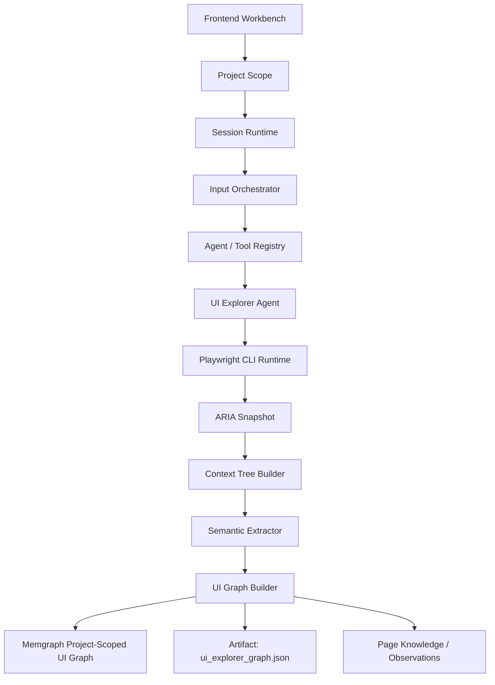
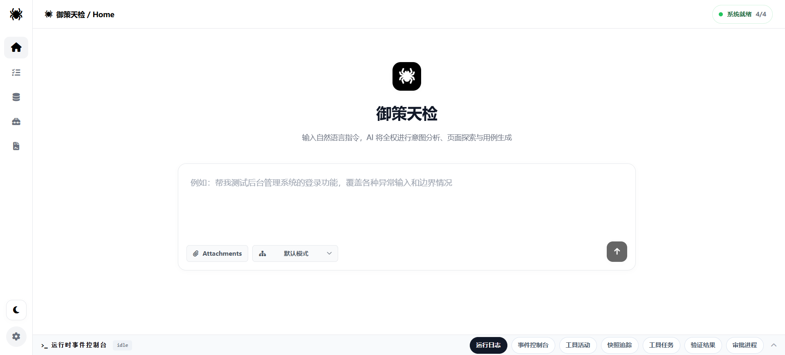
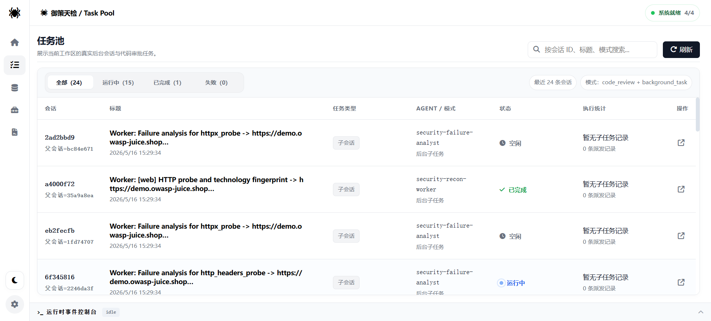
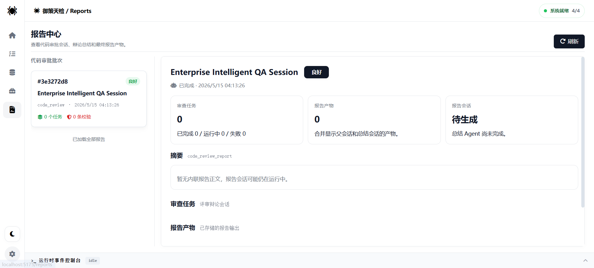
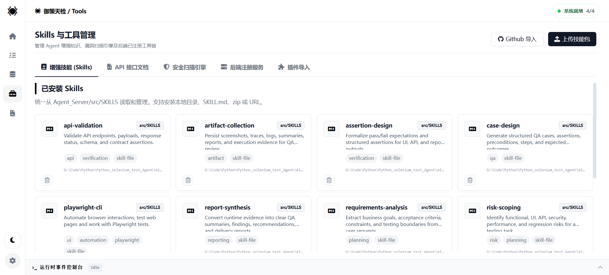
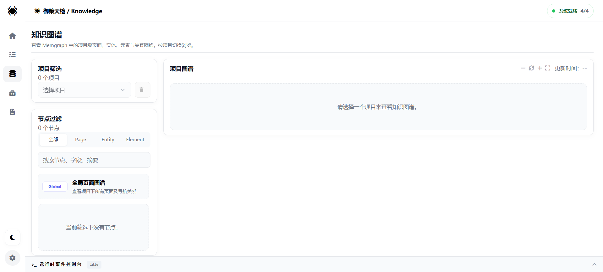
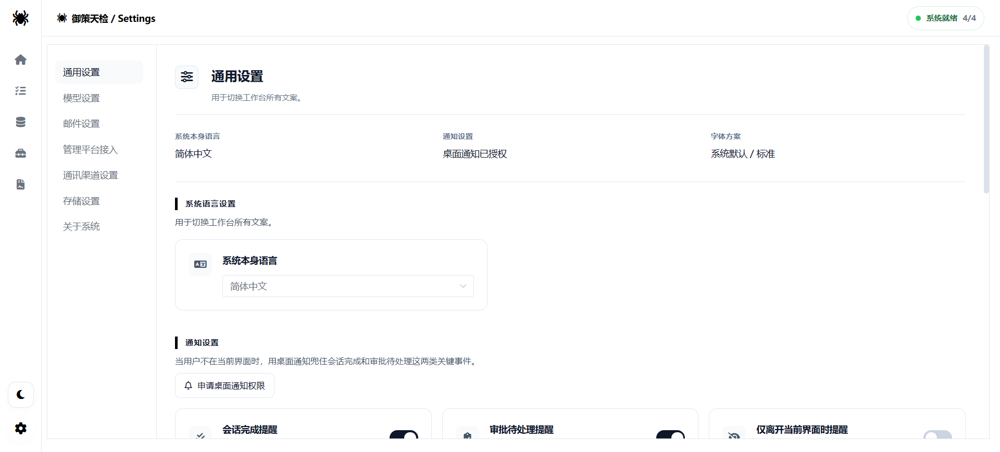
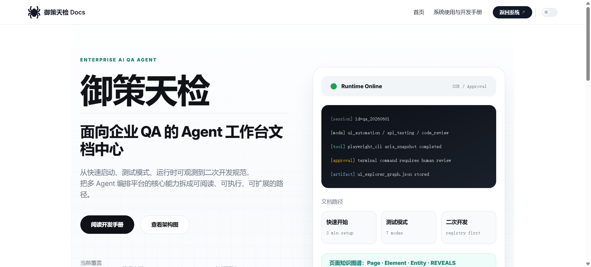
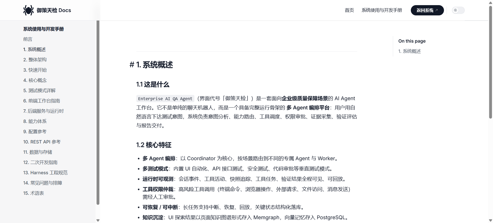
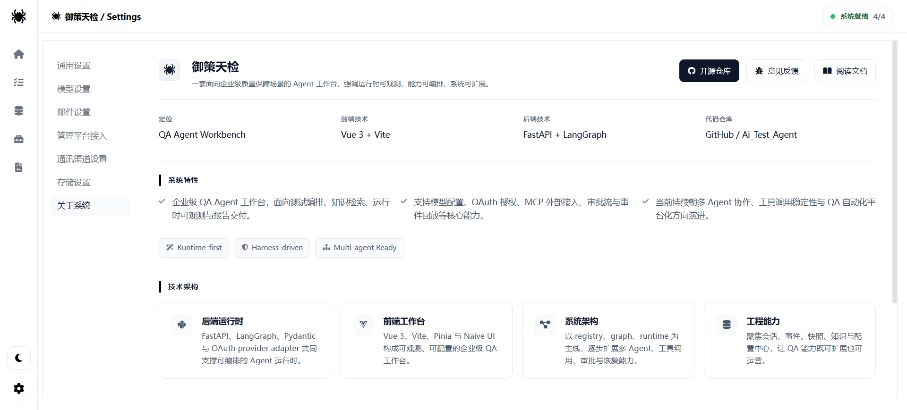

# 御策天检 · AI 测试平台

<div align="center">
  

  
  
  
  
  
  
  
  
</div>

> **御策天检**（英文代号 AI Test Agent / Enterprise AI QA Agent）是一套面向质量保障场景的 AI 测试系统仓库。
> 仓库内并存**两代产品**：早期的一站式 Web 测试平台，和当前正在迭代的 Agent 工作台。

---

## E-API 赞助支持

本项目获得 **E-API** 赞助支持。E-API 提供聚合模型 API 服务（中转站），可用于开发者工具和 AI 应用的模型接入。

新用户通过下方专属链接注册，可获得 **5 元产品额度**：

[领取 E-API 新用户 5 元产品额度](https://eapi.site/register?aff=KZQTHE)

邀请码：`KZQTHE`

> **推广说明**：以上链接为赞助推广链接。你通过该链接注册或消费后，我可能获得 E-API 提供的推广返佣。E-API 及本推广活动与 GitHub 官方无关。产品额度、可用范围及返佣结算以 E-API 活动页面的现行规则为准。

赞助商信息在系统内也是可见的，不只是写在 README 里：

- **前端入口**：桌面端 / Web 顶栏右侧的赞助商轮播 logo + 列表弹窗（`agent_web/src/components/layout/SponsorEntry.vue`，15 种语言均有文案）
- **读取接口**：`GET /api/v1/sponsors`（只返回 `enabled=true` 的记录，无需鉴权）
- **数据来源**：MySQL 表 `system_sponsor_config`，首次启动自动写入默认记录（E-API → `https://api.ewo.so/`，类型「中转站」）
- **Logo 资源**：`Enterprise_AI_QA_Agent/agent_web/public/sponsors/e-api.png`
- 当前未提供后台 CRUD 界面，新增/修改赞助商直接维护该表

---

## 一、系统总览：仓库里有两个项目

| | **Enterprise_AI_QA_Agent**（当前迭代） | **Web 版**（已停止迭代） |
|---|---|---|
| 目录 | `Enterprise_AI_QA_Agent/Agent_Server` + `Enterprise_AI_QA_Agent/agent_web` | 根目录 `Agent_Server/` + `agent_web_server/` |
| 定位 | 企业级 QA 场景的**多 Agent 编排工作台**：会话 / 事件流 / 审批 / 回放 / 任务池 / 报告 / 知识图谱 | 一站式**智能自动化测试平台**：用例生成 → 浏览器执行 → Bug 分析 → 报告邮件 |
| 后端 | FastAPI + **LangGraph** + Pydantic v2，`/api/v1` 前缀，21 组路由，14 种测试模式，54 个 Skill | FastAPI + Browser-Use 0.11.1 + 自研 LLM 适配器层（11 个 Provider） |
| 前端 | Vue 3.5 + Vite 6 + Naive UI + TypeScript，9 个视图，15 种 locale，**Electron 桌面端**（产物 `御策天检.exe`），VitePress 手册 | Vue 3.4 + Vite 5 + Naive UI，56 个 `.vue` 页面 |
| 存储 | PostgreSQL(运行时 + pgvector 向量记忆) + MySQL(配置) + Memgraph(图谱) + Redis(分布式锁) + **RustFS**(产物对象存储) | MySQL + Qdrant(页面知识库) + **MinIO**(接口文件) |
| 状态 | **活跃**，提交持续到 2026-08-27 | **冻结**，仅作历史与参考实现保留 |
| 详细文档 | [Enterprise_AI_QA_Agent/README.md](Enterprise_AI_QA_Agent/README.md) | 本文第四章 + [PROJECT_DESIGN.md](PROJECT_DESIGN.md) |

### 关于迭代状态（说明白，避免误解）

- **Web 版已经不再迭代。** 按本仓库的提交记录：`Agent_Server/` 与 `agent_web_server/` 的最后一笔代码改动是 **2026-04-15**（仓库自另一账号迁移导入），此后仅 **2026-06-26** 动过一次 `.env.example`（3 行）。`agent_web_server/` 全部历史只有一笔提交。它是上一代方案，功能仍然完整可跑，但**不会再补新特性，也不会跟进安全/依赖升级**。
- **`Enterprise_AI_QA_Agent` 是唯一在推进的分支。** 它不是 Web 版的简单改名，而是换了骨架：从"平台内置流程 + 脚本执行器"改成"注册中心 + LangGraph 图编排 + 可观测工作台"。
- **节奏偏慢是事实，原因是主业。** 这个项目是我下班后和周末做的，工作忙的时候可能几周不动；但每次动手都按 [AGENTS.md](Enterprise_AI_QA_Agent/AGENTS.md) 的纪律走（先查证、根因修复、完成必验证），所以提交粒度小、带测试。不要按"开源项目的更新频率"来评估它。
- **不要交叉复制代码。** 两代项目的对象存储客户端、模型适配层、路由前缀都不一样（MinIO vs RustFS、自研 `llm/providers` vs `application/model_adapters`、`/api/*` vs `/api/v1/*`）。Web 版里有价值的部分是**测试领域策略本身**（止损、模糊匹配、瞬态 UI 感知、JSON 修复管线、平台适配器），这些思路在 Enterprise 版里以 Harness/Skill 的形式重做。

### 品牌与命名对照

| 名称 | 出现位置 |
| --- | --- |
| 御策天检 | 产品中文名：前端顶栏、Electron 产物、VitePress 手册、设计文档 |
| AI Test Agent / `Ai_Test_Agent` | 仓库名、Web 版后端 `APP_TITLE = "AI Test Agent API"` |
| Enterprise AI QA Agent | Enterprise 版 `.env` 中的 `APP_NAME`、其 README 标题 |

---

## 二、Enterprise_AI_QA_Agent（当前项目）

参考 `claude_code_ui_Agent` 的运行骨架构建，目标是"能规划、能调工具、能审批、能中断恢复、能出报告"的 AI 测试运行骨架，而不是一个聊天页面。后端应用版本 `0.2.0`。

### 2.1 三层骨架

1. **`registry/`** —— Agent / Tool / Model / Skill / MCP / Mode 六大注册中心，新增能力优先接这里。当前注册 **45 个 Agent**、**57 个 Tool**。
2. **`graph/` + `runtime/`** —— LangGraph 组织运行链路，沉淀可恢复、可审批、可中断、可重放的执行状态机（`planner → permission_gate → model_invoker → tool_executor → finalizer / reexpander`）。
3. **`agent_web` + `api/routes`** —— 前端是工作台（会话、事件流、审批、回放），后端不是单一 `/chat`，而是 session shell + event stream + approval + dispatch 的统一运行接口。

### 2.2 测试模式（14 种）

`Agent_Server/src/modes/`，全部在 `registry/modes.py` 注册：

| 模式 | 说明 |
| --- | --- |
| `api_testing_mode` | 链路最完整：API 文档解析 → 端点圈定 → 依赖规划 → 前置条件解析 → 执行 → 验证/评估 → 报告，含子代理协调与任务池 |
| `performance_testing_mode` | 需求接入 → 负载建模 → k6 / JMeter 引擎执行 → 结果解析 → 失败分析 → 报告；含目标保护（allowlist、VU/RPS/时长上限、smoke 前置） |
| `security_testing_mode` | 基于 Docker（Kali）运行器的安全测试编排，含攻击链循环与漏洞库落库（`agent_security_bugs`） |
| `ui_automation_mode` | UI 自动化（Playwright CLI Runtime）+ UI 录制编排 + 回放执行器 |
| `compatibility_testing_mode` | 兼容性测试 Runner |
| `smoke_testing_mode` | 冒烟测试（计划目录 / 版本 / 运行历史 / 回归候选四张表） |
| `code_review_mode` | 代码评审 |
| `default_mode` | 默认对话模式 |
| `integration_testing_mode` | 集成测试 |
| `unit_component_testing_mode` | 单元 / 组件测试 |
| `mobile_testing_mode` | 移动端测试 |
| `visual_regression_testing_mode` | 视觉回归 |
| `accessibility_testing_mode` | 无障碍 |
| `reliability_testing_mode` | 可靠性 / 稳定性 |

### 2.3 Skills 体系

`Agent_Server/src/SKILLS/` 下 **54 个技能包**，每个含 `SKILL.md`，由 `registry/skills.py` 扫盘加载，并支持 marketplace 安装。覆盖 `api-test-generation`、`playwright-e2e-testing`、`playwright-cli`、`k6-load-testing`、`jmeter-load-testing`、`owasp-security-testing`、`mutation-testing`、`property-based-testing`、`selenium-testing`、`cypress-e2e-testing`、`docker-testcontainers`、`vue-component-testing`、`detox-mobile-testing`、`xcuitest-ios-testing`、`agently-mail` 等。

### 2.4 UI 录制 → 回放 → 用例草稿（最近一条主线）

这是当前投入最重的方向，把"人手工点一遍"变成"可回放的用例资产"。分阶段推进，**P0/P1/P2 已完成并带测试，P3 阻塞**。

| 阶段 | 交付 | 关键文件 |
| --- | --- | --- |
| 契约与存储 | `ui_recording` / `ui_recording_event` 幂等建表，事件流批量幂等追加（批内去重 + `ON CONFLICT DO NOTHING`），流水只增不改，销毁保留审计 | `src/schemas/recording.py`、`src/infrastructure/recording_store.py` |
| 注入脚本 | 三端共用 `recorder.js`：八类事件采集 + 六元 locator 链 + 像素三件套 + SHA-1 `dom_hash`；密码 value 与 accessible name 双重脱敏；top 统一 seq 跨导航续号 | `src/application/recorder/assets/recorder.js`，由 `GET /api/v1/recordings/recorder.js` 下发 |
| 驱动抽象 | `BrowserDriver` 七方法契约 + kind 注册表；三种驱动齐备：`embedded`（Electron 三通道桥接）、`cdp-attach`（`connect_over_cdp` 复用外部 Chrome/Edge 真实登录态，close 仅断连不杀浏览器）、`playwright-managed`（`launch_persistent_context` 自启受管浏览器，headed + 登录态持久 profile） | `src/application/recorder/drivers/{base,embedded_bridge,cdp_attach,playwright_managed,playwright_common}.py` |
| 会话编排 | 五动作迁移表 + 内存占位防并发 + 事件攒批落库 + 固化触发 | `recorder_session_service.py`、`recording_approval_service.py` |
| 编排改造 | **三源检索**（图谱 Pages≥3 + Elements≥30 / 活跃用例 / 语义记忆）任一充分则跳过录制，不足则发 `ui_recording` 审批；拒绝则降级 AI 探索；服务缺失全链路降级不阻断 | `ui_resource_assessor.py`、`modes/ui_automation_mode/runtime.py` |
| API | `/api/v1/recordings` 下 11 个端点：会话管理 / Electron 三通道桥接 / 数据面控制；`events:batch` 幂等三态；`DELETE` 图先库后可重试 | `src/api/routes/recordings.py` |
| 图谱固化 | 录制事件流固化为 Memgraph 子图：`Recording` / `Action` 节点 + `HAS_STEP` / `TARGETS` / `ON_PAGE` / `NAVIGATED_TO` 边，Element 指纹内容寻址收敛 | `src/application/exploration/recording_graph_store.py` |
| 桌面端 | Electron 录制窗口 + 控制条（四按钮状态机、2s/20 条攒批转发、指令 long-poll、关窗自动补发 stop、截图 multipart），销毁内联二次确认 | `agent_web/electron/recorder-window.mjs`、`src/views/RecorderWindowView.vue`、`src/features/recorder/` |
| 回放执行器 | **七级定位决策链**逐级重试（id → testid → role+name → css → xpath → bbox 几何重锚 → 坐标兜底）；脱敏 fill 与文件上传安全跳过；单步失败不中断 | `replay_executor.py`（`RecordingReplayExecutor`） |
| 录制转用例 | 事件流 → 人话步骤 + 定位链 data + 三级退化基线断言；`source_refs` 可追溯到 `ui_recording`；委托既有 `create_draft` 进"评审 → 固定 → 冻结"链路，零状态机新增 | `recording_case_draft_service.py` |
| 断言建议 | `page_effect` 规则四类置信度分级（`navigated_to` high / DOM 变更 medium / title medium / 可交互数 low），`description` 携带依据供评审筛选，截断防上下文爆炸 | `assertion_suggester.py` |
| 待做 | **P3 ego-lite 驱动 ⛔ 阻塞**（ego-lite 仅支持 macOS）；录制主链路的纯手工 GUI 验收项 | [docs/ui_recording_development_plan.md](Enterprise_AI_QA_Agent/docs/ui_recording_development_plan.md)、[ui_recording_progress.md](Enterprise_AI_QA_Agent/docs/ui_recording_progress.md) |

> 已知文档漂移：`docs/ui_recording_progress.md` 等进度文档里仍写着 MinIO 和"12 端点"。代码已迁移到 **RustFS**，按路由装饰器统计为 **11 个端点**。以代码为准。

### 2.5 UI Explorer Agent：从"执行器"收敛为"页面结构理解引擎"



核心约束：

- 主数据源是 Playwright `aria_snapshot()`，**不是** DOM 扁平扫描。
- `ui-page-explorer` 只探索和建模，输出 `pages / elements / entities / edges`；不走 Verification / Evaluation Harness，不生成用例、不做断言、不判定通过失败。
- 图谱节点：`Page` / `Element` / `Entity`；关系：`CONTAINS` / `BELONGS_TO` / `TRIGGERS_NAVIGATION` / `REVEALS`。
- 登录不是固定流程：只有检测到可见 password input / 登录表单后才使用调用方给的 `login_credentials`；`max_interactions` 用于受控点击非导航控件，采集弹窗、抽屉、Tab、展开区等动态状态，写入 `element_reveals_element`。
- **大模型的角色**：决定探索策略、做语义解释（业务命名、实体归并、页面意图总结）；但**不作为事实源**——页面结构、可见性、链接、交互结果必须来自 Playwright / ARIA snapshot / Memgraph 证据；**不硬编码流程**，模型只提出可审计的探索意图。

### 2.6 用例驱动链路（固定流程，不可绕过）

> 生成草稿 → 评审 → 启用固定版本 → 套件冻结版本 → 运行条目原子领取 → 结果与证据入库 → 失败项创建新回归运行

禁止重置或复用已完成运行条目，禁止用自由文本项目名替代正式 `project_id`。对应路由组 `case_management` / `suite_management` / `run_management`（路径形如 `/test-cases/{id}`、`/projects/{id}/test-cases`，无额外前缀），数据表 `agent_test_cases` / `agent_test_case_versions` / `agent_test_suites` / `agent_test_suite_items` / `agent_test_runs` / `agent_test_run_items` / `agent_test_run_attempts` / `agent_test_case_results`。

### 2.7 后端能力清单

- 会话创建/读取、消息发送、SSE 事件流、事件历史与 replay 回放、快照、interrupt / resume 审批、无头执行（headless execute）
- Coordinator / Worker 子代理调度、工具作业（tool jobs）与产物（artifacts）管理
- MCP 连接管理与工具桥接（`MCP_STDIO_COMMAND_ALLOWLIST` stdio 命令白名单）
- 向量记忆（pgvector，默认维度 1536，`hnsw` / `ivfflat` 索引；补数 CLI `src/cli/backfill_memory_embeddings.py`）
- Memgraph 知识图谱与项目级 UI 图谱
- 模型多 Provider 适配（OpenAI / Anthropic / Gemini 等）+ OAuth 授权（Azure AD / Google / GitHub / CodeBuddy / TRAE / Codex）
- 邮件能力（agently-mail，含腾讯邮箱认证监控，Redis 分布式锁）
- 渠道配对网关（`qq` / `feishu`（`lark` 归一为 `feishu`）/ `weixin` 扫码配对，凭据加密 `CHANNEL_CREDENTIAL_ENCRYPTION_KEY`）
- 上传安全扫描：RustFS 三桶流转 `temp → safe / quarantine`，`UPLOAD_SCAN_MAX_BYTES=10MB`，风险阈值 30/70
- Docker 管理面板：一键拉起并管理 Redis / RustFS / MySQL / Postgres / Memgraph / 安全与性能测试引擎容器
- 上下文治理：`CONTEXT_COMPACTION_WATERMARK`、`TOOL_MESSAGE_MAX_CHARS` 防上下文膨胀
- 数据导出 / 导入 / 清理接口（`/settings/data/*`）

### 2.8 存储矩阵

| 存储 | 用途 |
| --- | --- |
| **PostgreSQL** | 运行时数据：`agent_sessions` / `agent_session_messages` / `agent_session_events` / `agent_session_snapshots` / `agent_session_approvals` / `agent_session_resources` / `agent_tool_jobs` / `agent_tool_artifacts` / `agent_memories`(向量) / `agent_mcp_servers` / `agent_security_bugs` / `agent_projects` / `agent_api_docs` / `agent_perf_runs` / smoke 四表 / 用例套件运行八表 / `ui_recording` / `ui_recording_event` |
| **MySQL** | 配置数据：`llm_model_config`、`system_email_config`、`system_channel_config`、`system_sponsor_config` |
| **Memgraph** | 知识图谱、项目级 UI 图谱、录制子图（`UI_GRAPH_BACKEND=memgraph`，neo4j 驱动，7687） |
| **Redis** | 分布式锁（邮箱认证锁等） |
| **RustFS** | 产物对象存储 + 上传扫描三桶（经 boto3 S3 客户端访问；已替换早期 MinIO 方案） |

初始化脚本：[databases/1、MySQL/QA_Agent.sql](Enterprise_AI_QA_Agent/databases/1、MySQL/QA_Agent.sql)、[databases/2、PSQL/public.sql](Enterprise_AI_QA_Agent/databases/2、PSQL/public.sql)

### 2.9 前端工作台

- **9 个视图**：`WorkbenchView`（工作台首页：流式消息、运行状态、审批面板、Runtime Event Console）、`TaskPoolView`、`ProjectsView`、`KnowledgeView`、`ToolsView`、`ReportsView`、`SettingsView`、`FlowView`（编排轨迹）、`RecorderWindowView`（录制窗口，bare shell 路由隔离顶栏侧栏）
- **插件化设置中心**：模型、邮箱、渠道、Docker、存储、平台等分组面板
- **15 种 locale**：zh-CN / zh-TW / en-US / ja-JP / ko-KR / de-DE / fr-FR / es-ES / pt-BR / ru-RU / ar-SA / hi-IN / id-ID / th-TH / vi-VN
- **Electron 桌面端**：Windows 打包产物「御策天检.exe」；后端地址由 `QA_AGENT_API_ORIGIN` 覆盖，默认 `http://127.0.0.1:1032`
- **VitePress 文档站**：`npm run dev` 时随应用一起启动，手册编号 0（前言与目录）~ 15（术语表）共 16 篇，见 2.11

### 2.10 快速启动

```bash
# 0. 基础设施：可手起容器，或用设置页的 Docker 管理面板一键拉起
#    Postgres(5432) / MySQL(3306，代码默认 3307) / Memgraph(7687) / Redis(6379) / RustFS(9000)

# 1. 配置
cp Enterprise_AI_QA_Agent/Agent_Server/.env.example Enterprise_AI_QA_Agent/Agent_Server/.env
#    按实际填 MYSQL_* / POSTGRES_* / MEMGRAPH_* / RUSTFS_* / REDIS_URL / DOCKER_*_IMAGE

# 2. 后端（Python >= 3.11）
cd Enterprise_AI_QA_Agent/Agent_Server
pip install -e .[dev]
uvicorn src.main:app --reload --port 1032     # 或 python -m src.main（已内置 1032）

# 3. 前端
cd ../agent_web
npm install
npm run dev          # 应用(5175) + VitePress 文档站
npm run dev:app      # 只起应用

# 4. 桌面端（可选）
npm run desktop      # 本地跑 Electron
npm run desktop:pack # 打包 Windows 安装目录（另有 desktop:build / desktop:dist）

# 5. 测试
cd ../Agent_Server && pytest tests     # 92 个测试文件
cd ../agent_web && npm test            # vitest
```

要点与坑：

- 健康检查 `GET /api/v1/health`；所有路由统一前缀 `/api/v1`。
- 端口 **1032 不可通过 env 配置**（`main.py` 与 Electron 硬编码），前端代理用 `VITE_API_PROXY_TARGET` 覆盖，默认 `http://127.0.0.1:1032`。
- 前端 dev 端口 **5175（strictPort）**，但 `.env.example` 里 `CORS_ORIGINS` 默认写的是 **5173** —— 开发态走 Vite 代理属同源、通常无感；一旦绕过代理直连后端（Electron、自调 HTTP），就会命中浏览器跨域拦截，先把 5175 加进去。
- 以下变量**无默认值，缺失即启动失败**：`REDIS_URL`、`AGENTLY_CLI_CONFIG_ROOT`、`AGENTLY_AUTH_LOCK_TTL_SECONDS`、`AGENTLY_AUTH_LOCK_WAIT_SECONDS`、`AGENTLY_AUTH_CHECK_INTERVAL_SECONDS`、`DOCKER_MANAGED_CONTAINER_PREFIX`、`DOCKER_MANAGED_VOLUME_ROOT`、`DOCKER_{REDIS,RUSTFS,MYSQL,POSTGRES,MEMGRAPH}_IMAGE`。
- `.env.example` 的 `MYSQL_PORT=3306` 与代码默认 `3307` 不一致，以你写的 `.env` 为准。

### 2.11 核心文档

- [Enterprise_AI_QA_Agent/README.md](Enterprise_AI_QA_Agent/README.md) —— 项目自己的说明（注意：其中"14 组路由 / 8 种模式 / 10 个 Skill / 6 个页面"为早期口径，实际为 21 / 14 / 54 / 9）
- [Claude_Code_UI_Agent_全流程复刻规范.md](Enterprise_AI_QA_Agent/docs/Claude_Code_UI_Agent_全流程复刻规范.md)
- [HARNESS_ENGINEERING_开发规范.md](Enterprise_AI_QA_Agent/docs/HARNESS_ENGINEERING_开发规范.md)
- [系统全景说明_每个模块要干啥.md](Enterprise_AI_QA_Agent/docs/系统全景说明_每个模块要干啥.md) —— 逐目录解释"每个模块负责什么、解决什么问题"
- [AGENTS.md](Enterprise_AI_QA_Agent/AGENTS.md) —— AI 协作开发纪律（先查证 / 禁臆造 / 根因修复 / 完成必验证 / 提交规范）
- VitePress 手册（编号 0~15，共 16 篇）：[agent_web/docs/docs/](Enterprise_AI_QA_Agent/agent_web/docs/docs/)（前言与目录、系统概述、整体架构、快速开始、核心概念、测试模式详解、前端工作台、后端运行时、Agent/Tool/Skill/MCP 能力体系、配置参考、REST API、数据与存储、二次开发、Harness 规范、FAQ 排障、术语表）
- 规划与调研：[方案1.0.md](Enterprise_AI_QA_Agent/方案1.0.md)、[参考项目深度调研与系统增强路线图_2026-08-17.md](Enterprise_AI_QA_Agent/参考项目深度调研与系统增强路线图_2026-08-17.md)、[任务记录.md](Enterprise_AI_QA_Agent/任务记录.md)

---

## 三、界面速览（Enterprise 版）

| 工作台首页 | 任务池 | 报告中心 |
| --- | --- | --- |
|  |  |  |

| 工具中心 | 知识库 | 通用设置 |
| --- | --- | --- |
|  |  |  |

| 文档站 | 使用手册 | 关于系统 |
| --- | --- | --- |
|  |  |  |


> 结构图 v1 为早期版本：图中的「ArangoDB」现为 **Memgraph**（`agent_memories` / 会话事件 / tool_jobs 等运行时数据实际在 PostgreSQL），「data/artifacts」现由 **RustFS** 承载；其余分层关系仍然成立。

---

## 四、Web 版（已停止迭代）能力全览

> 以下是上一代平台的完整能力记录，保留作为功能参考与二次开发底稿。
> 启动方式见本文第六章。更细的设计说明见 [PROJECT_DESIGN.md](PROJECT_DESIGN.md)（793 行，13 章，明确只覆盖 `Agent_Server/` + `agent_web_server/`）。

平台基于 LLM + 浏览器自动化，实现测试用例智能生成、自动执行、Bug 分析和报告生成。底层模型架构用**适配器模式**重构，内置智能止损、模糊匹配、Agent 判定优先、瞬态 UI 感知、用例间状态隔离等策略。

**差异化不在"AI 能不能测"，而在"AI 测试能不能更低成本、更稳定、可复用、可持续地运行"：**

- **知识复用**：页面探索结果进知识库，同页面优先命中缓存，减少重复探索与上下文膨胀
- **版本感知**：页面结构变化时自动 Hash 比对 + Diff 分析，辅助回归测试
- **受控生成**：模板 + LLM 混合生成用例，降低 Token 消耗并提升结构稳定性
- **稳定执行**：止损、循环检测、429 熔断、模型自动切换、状态隔离等运行保护
- **测试治理**：报告、Bug、邮件通知、Token 统计、多模型管理
- **多平台集成**：统一适配器工厂接入 11 大项目管理平台，Bug 推送 + 用例双向同步

### 4.1 智能测试用例生成
自然语言需求 → 结构化用例（模块/标题/步骤/预期结果/优先级）；支持 TXT、PDF、DOCX、DOC 导入；自动覆盖正常、异常、边界与安全场景。

### 4.2 自动化测试执行与智能策略
- 基于 **Browser-Use 0.11.1**，用 CDP 协议 + DOM 分析精准操作
- **单量 / 批量执行**：单量逐条出报告；批量连续执行出统一汇总报告，支持暂停/恢复/停止
- **智能止损**：连续 3 步无效操作自动熔断；单用例超时控制
- **模糊匹配验证**：语义级断言（"账号或密码错误" ≈ "密码错误"），减少误报
- **Agent 判定优先**：Agent 自身 `done(success=True/False)` 优先于关键词匹配和 browser-use 内置 judge；`success` 语义是"实际结果是否符合预期"，异常场景用例（错误密码登录且确实失败）判 `success: true` —— 修掉了旧版搜"失败/error"导致异常用例误判 fail 的问题
- **瞬态 UI 感知**：Toast/Message/Notification 这类 1-3 秒消失的提示，指导 Agent 先 wait 再观察；禁止用 `extract`/`run_javascript` 搜已消失的 DOM；改用 URL 变化、页面内容变化、表单是否仍在等间接证据判定
- **用例间状态隔离**：每条用例执行前经 CDP 清 Cookies + localStorage/sessionStorage 并导航回目标 URL，解决上一条登录态残留污染下一条结果

### 4.3 LLM 输出容错与 JSON 修复
- **Provider 感知解析**：每个 Provider 内置 `parse_json_response()`，按各模型输出特点专门处理
- **多层修复管线**：剥离 `<think>` 标签 / markdown 代码块 / 前后缀文字 → 括号匹配提取（`_find_matching_brace`）→ 修尾部逗号与缺逗号 → 截断 JSON 补全 → `json-repair` 库兜底
- **解析失败自动重试**：关键流程 JSON 解析失败时降低 temperature 重新请求
- **Action 别名映射**：`LLMWrapper` 内置 20+ 映射，把模型返回的非标准 action 转成 browser-use 0.11.1 标准名（`evaluate → run_javascript`、`scroll_down → scroll`、`click_element → click`）；各 Provider 可再传自己的专属别名

### 4.4 接口测试（API Testing）
- **接口文件管理**：Markdown 接口文档上传 MinIO，自动解析 endpoints（method/path/summary/params/examples）；多策略解析器支持标题内联、中文 KV（`- **路径**: /v1/xxx`）、Markdown 表格、全文正则扫描兜底；卡片式管理界面支持详情/原文预览/删除
- **智能接口匹配**：两段式（关键词粗筛 + LLM 精排）按用例文本推荐接口文件
- **三步式执行**：选用例 → AI 匹配接口（展示推荐/候选/预览，可手动切换）→ 配环境（Base URL、Headers）执行：LLM 生成可执行 DSL → HTTP Runner 发请求 → 断言验证
- **全链路闭环**：结果写 `test_records` → 生成 `test_reports` → 失败用例建 `bug_reports` → 自动邮件通知 `auto_receive_bug=1` 联系人

### 4.5 一键测试（OneClick Test）
输入一句话任务（如"测试登录功能"），AI 全权执行：意图分析 → 自动获取环境 → 浏览器探索页面 → 生成子任务 → 生成用例 → 用户确认 → 执行测试。

- **统一环境上下文**：标准化 `env_info`（`target_url / login_url / username / password / extra_credentials / env_name`），探索与用例生成共用；三级降级：用户指令内联 → 数据库默认环境 → 环境变量兜底
- **探索主体是 Browser-Use Agent**（FastAPI + 系统提示词驱动），不依赖自定义 Playwright 点击执行器
- **结构化探索产物**：页面快照 + DOM 摘要，提取 `forms / tables / buttons / links / page_sections / dialogs`
- **三级任务树 TaskTree**：L1 用户意图 / L2 功能规划 / L3 原子用例；状态 pending/confirmed/skipped/running/done/failed，前端可视化 + JSON 序列化
- **模板混合生成**：优先模板，不适用时回退纯 LLM
- **对话式界面**：类 ChatGPT 流，实时展示分析进度、探索结果、子任务规划、执行结果
- **确认机制 + 浏览器复用**：用例可勾选/编辑/调优先级；执行阶段所有用例共享一个 BrowserSession
- **运行保护**：`LoopDetector` 循环熔断、`FailoverChatModel` 429/连续失败自动切备用模型、`asyncio.Event` + 强杀浏览器实现真停止、429 配额耗尽立即停止后续用例、探索取消统一收口为 `cancelled / 已取消` 终态（停轮询、关 loading、关浏览器）
- **自动通知**：完成后把测试报告 + Bug 报告整合成一封 HTML 邮件发给 `auto_receive_bug=1` 联系人
- **Skills 知识注入 / RAG 加速**：执行时把相关 Skills 当"便签"注入提示词；执行前优先查页面知识库，命中则跳过浏览器探索

### 4.6 Skills 管理
Skills 是 Markdown 格式的程序化知识文件。支持 GitHub 仓库下载（`GITHUB_PROXY` 代理）与手动上传 `.md`（网络受限时推荐）；卡片式界面启用/禁用/删除/查看详情；执行时便签式注入 LLM 系统提示词。

### 4.7 多模型适配与管理
`llm/providers/` 下 **11 个 Provider**：OpenAI、Anthropic、Google、DeepSeek（含 `<think>` 处理与 R1 专用 `DeepSeekR1ChatOpenAI`）、Azure、Alibaba/ModelScope（Qwen 系列，含结构化输出适配）、MiniMax、Ollama（含 `DeepSeekR1ChatOllama`）、Mistral、Moonshot、generic（通用 OpenAI 兼容，覆盖硅基流动 / 智谱 / Grok / OpenRouter 等）。

供应商管理页可视化 CRUD（API Key / Base URL / 默认参数）；Qwen3.5 等大参数模型自动启用 `dont_force_structured_output` + `add_schema_to_system_prompt`；`LLMWrapper` 统一拦截 `ainvoke` 做消息转换、JSON 清洗、action 格式修正、别名映射；`ModelAutoSwitcher` 按数据库优先级与激活状态调度，429/超时/连续失败自动切换；Token 与成本统计按模型、按来源可查。

### 4.8 智能 Bug 分析
自动分析失败原因，区分系统 Bug 与脚本错误；智能定级（一级致命 ~ 四级轻微）；提取复现步骤、生成带截图报告；关联用例并记录预期/实际结果。

### 4.9 报告与通知
运行测试报告（执行日志、思维链、步骤截图）、综合评估报告（多报告聚合 + A/B/C/D 质量评级 + 通过率 + 改进建议，Markdown 渲染）、Bug 报告（按严重程度/状态/错误类型）。
邮件采用**工厂模式**统一调度（`Email_manage/sender.py`）：内置 Resend、阿里云 DirectMail(HMAC-SHA1)、SMTP 自定义(STARTTLS)、CyberMail；新增服务商只需实现 `_send_via_xxx()` 并在 `_PROVIDER_MAP` 注册一行，所有调用方零改动；支持"测试模式"强制改投测试邮箱。

### 4.10 页面知识库（RAG 记忆层）
与一键测试共用同一条 Browser-Use 探索链路（`Exploration.browser_use_agent_explorer`）。
Qdrant 存 Embedding，MySQL 存索引；一键测试前先按 URL 精确匹配，命中即跳过探索省 Token；未命中用余弦相似度兜底（阈值 **0.82**）；新鲜度策略：4 小时内直接复用、超 30 天标记"老化"并按需重探；**Diff Engine** 对比新旧页面结构，按字段/按钮/表单/表格的增删改分类，自动推荐需补充的回归子任务；Collection 配置 UI 可视化配置 Qdrant（host/port/collection/维度/Cosine|Dot|Euclid|Manhattan）与 Embedding 服务，持久化到 `qdrant_collection_config` 表，支持"初始化"与"强制重建"；统计面板展示总记录数/向量数/老化数/Qdrant 健康状态。
Windows 注意：模块初始化时自动注入 `NO_PROXY=localhost,127.0.0.1,::1`，防止系统代理拦截 httpx 到本地 Qdrant 的请求。

### 4.11 AI 驱动的自动化渗透测试（Pentest_Agent）
基于 PentAGI 架构复刻的多 Agent 协作渗透测试系统（早期 README 标注完成度 85%，仓库内已无 `IMPLEMENTATION_STATUS.md` 佐证，请按"可用但仍在补齐"看待）。

- **三层上下文传播**：FlowContext → TaskContext → SubtaskContext；**状态机** Created → Running → Waiting/Finished/Failed，支持暂停/恢复/重试；**Worker & Controller** 异步调度
- **Flow / Task / Subtask** 三层：Flow 对应 `security_scan_tasks`，Task 如 SQL 注入测试，Subtask 对应 `pentest_subtasks`
- **13 类业务 Agent**（`agents/` 目录含 `base.py` / `types.py` 共 15 个模块）：Primary 协调、Generator 分解 3-7 个子任务、Refiner 动态调整计划、Reporter 出报告、Pentester 调 Nmap/Nuclei/SQLMap、Coder 写脚本、Searcher 收集情报、Reflector 纠错、Installer 装工具、Adviser 给建议（OWASP/PTES）、Memorist 长期记忆、Enricher 信息增强（CVE/CNVD/ExploitDB）、Assistant 交互
- **Agent Chain 引擎**：最多 100 次迭代；执行监控（同一工具连续 5 次或总 10 次触发 Mentor 介入）、重复检测（软限 3 次警告 / 硬限 7 次中止）、Reflector 结构化纠正、Tool Call Fixer 参数修复重试（≤3）、Caller Reflector 调用失败恢复与模型切换、链摘要防上下文溢出
- **20+ 工具**：`terminal`（容器内执行）、`file`、`browser`、`duckduckgo`（google/tavily/perplexity 需 Key，sploitus 待实现）、向量工具（`search_in_memory` / `store_guide` / `search_answer` / `store_code` …）、Agent 委托工具、屏障工具（`done` / `ask`）、18 种工具结果自动向量化
- **Docker 隔离**：默认镜像 `vxcontrol/kali-linux`；容器自动创建/启停/清理、端口动态分配、网络命名空间隔离、授予 `NET_RAW`/`NET_ADMIN`、`docker exec` 与双向文件复制
- **向量记忆**：复用 `Page_Knowledge/vector_store.py` + `embedding.py`，配置读 `qdrant_collection_config`；强制 `project_id` 隔离，用 `project_id + doc_type + content_hash` 生成确定性 point_id 防重复污染；余弦相似度 Top-K（默认 3，阈值默认 0.2）
- **实时日志**：MsgLog / AgentLog / SearchLog / TermLog / VectorStoreLog / Screenshot 六个 Worker
- **REST API**：`POST /api/v1/pentest/flows` 创建、`GET /api/v1/pentest/flows/{id}` 查询、`POST .../input` 提交 ask 回复、`POST .../stop`、`POST .../finish`
- **配置**：`PENTEST_USE_DOCKER`、`PENTEST_DOCKER_IMAGE`、`PENTEST_MAX_ITERATIONS`、`PENTEST_MAX_REFLECTOR_ROUNDS`、各工具超时与输出限制、安全工具路径（nmap/nuclei/sqlmap/xsstrike/ffuf/gobuster/msfconsole/hydra/amass/seclists）、SearXNG / Graphiti / Langfuse / OTEL / 实时推送
- **待完善**：Mentor 介入逻辑、搜索类工具 API Key、知识图谱（Neo4j + Graphiti，可选）、WebSocket/SSE 实时推送（可选）、完整版链摘要算法

### 4.12 AI 多引擎压测（PressTest_Agent）
README 早期版本漏记的模块。`Agent_Server/PressTest_Agent/`（路由前缀 `/api/presstest`）含 `agents/`、`email_service.py`、`models.py`、`report.py`，由约 30 个 `PRESSTEST_*` 变量驱动：Docker 网络 `presstest-network`、产物目录 `../save_floder/presstest`、引擎镜像 `grafana/k6` / `locustio/locust`（Web 8089）/ JMeter，以及 Prometheus + Grafana 开关。前端入口为 `views/test/PressTest.vue`。

### 4.13 多平台项目管理集成（11 个平台）
Factory Pattern 统一接入，`Project_manage/platforms/` 下 11 个适配器目录（另含 `shared/`），每个平台提供 Config / Cases / Bugs 三视图：

禅道（v1/v2 API 自适应，兼容 15.x~21.x）、Jira（Cloud & Server，REST v2/v3）、PingCode、Worktile、ONES、云效、TAPD、8Manage PM、Microsoft Project、Asana、ClickUp。

- **平台总控制台** `PlatformControl.vue`：统一视角激活/停用/测试连接
- **Bug 自动推送**：映射标题、复现步骤、严重程度、影响模块；失败时展示平台返回的具体原因
- **用例双向导入**：按产品全量 / 按套件 / 按用例 ID 三种模式；`asyncio.Semaphore` 并发拉取（默认 5，上限 20）；导入前查同名去重、同批次内也防重复；逐条调详情接口保证 `steps/precondition/expected/keywords` 完整
- **用例模板同步**：拉取平台字段结构，统一映射为 `module/title/precondition/steps/expected/keywords/priority/case_type/stage`
- **远程项目同步**：从已连接平台拉取项目列表同步到本地

### 4.14 UI 自主探索引擎
独立于 Browser-Use 的探索链路：LLM 原生 Function Calling + Selenium WebDriver，16 个浏览器工具（导航/点击/输入/截图/读页面/查找元素…）支持 2-5 个并行；三阶段 Bootstrap（自动导航并登录）→ Agent Loop（自主决策，最多 40 轮）→ Result Extraction；`MAX_CONTEXT_MESSAGES = 40` + 工具结果预算控上下文；Browser-Use 风格元素脉冲高亮；失败自动重试并改用精确 XPath；可选自动沉淀进页面知识库。

### 4.15 数据可视化仪表盘
测试趋势、Bug 分布、用例覆盖、安全扫描统计、漏洞严重程度分布、安全用例状态等多维图表，三列自适应布局。

---

## 五、Web 版目录结构

```
Ai_Test_Agent/
├── Agent_Server/                # 后端（FastAPI，APP_VERSION 2.0.0）
│   ├── app.py                   # ★ 入口（不是 src.py）
│   ├── Basic/                   # config.py 读 .env（HOST/PORT 缺失直接 raise）、routes.py 注册 21 个路由器、
│   │                            #   endpoints.py 提供 / /health /redoc、startup.py 生命周期与启动横幅
│   ├── llm/                     # 适配器层：base/factory/client/manager/config/auto_switch/wrapper
│   │   └── providers/           #   11 个 Provider
│   ├── OneClick_Test/           # 一键测试：router/service/session/loop_detection/skill_manager/task_tree/template_integration
│   ├── Api_Spec/                # 接口文件管理（MinIO + 多策略解析器）
│   ├── Api_Test/                # 接口测试（匹配 / DSL 生成 / HTTP Runner / 报告 / Bug / 邮件）
│   ├── Page_Knowledge/          # 页面知识库（vector_store / embedding / diff_engine / schema）
│   ├── UI_Exploration/          # UI 自主探索引擎（explorer / tools / prompts）
│   ├── Pentest_Agent/           # 渗透测试（agents / core / tools / providers）
│   ├── PressTest_Agent/         # AI 多引擎压测
│   ├── Project_manage/          # 11 平台集成（clients/factory + platforms/* + case_template）
│   ├── Execute_test/ Build_Use_case/ Bug_Analysis/ Build_Report/ Dashboard/
│   ├── Model_manage/ Email_manage/ Contact_manage/ Test_Tools/ database/
│   ├── Api_request/             # 集中管理所有 LLM 提示词
│   └── requirements.txt         # fastapi 0.115.0 / browser-use 0.11.1 / playwright 1.49.1 /
│                                #   langchain 1.0.0 / qdrant-client / minio 7.2.20 / json-repair / resend
├── agent_web_server/            # 前端（Vue 3.4 + Vite 5 + Naive UI 2.38 + Pinia + ECharts 6）
│   └── src/views/               # 共 56 个 .vue：test(6) / case(5) / mail(4) / report(3) / zentao(3) /
│                                #   model(2) / project(30，11 平台 Config·Cases·Bugs + 总控制台，Jira 无独立 Config) /
│                                #   dashboard(1) / skills(1) / prompt(1)
├── Enterprise_AI_QA_Agent/      # ★ 当前迭代项目（见第二章）
├── img/                         # Enterprise 版界面截图与结构图
├── outputs/                     # 5 份企业级指导文档 + 产品宣传 PPTX
├── PROJECT_DESIGN.md            # Web 版设计说明（793 行 / 13 章，不含 Enterprise 版）
├── 御策天检_项目设计文档.docx    # 同上的 Word 版
└── count_lines.py               # 按扩展名统计代码量
```

---

## 六、Web 版部署与运行（已冻结）

> 环境要求：Python 3.11+、Node.js 18+、MySQL 8.0+、MinIO、Qdrant（Docker）、Chrome/Edge。
> 仓库内**没有** docker-compose 文件（`Enterprise_AI_QA_Agent/项目借鉴/` 下的 compose 属于第三方参考项目），基础设施需自备。

```bash
# 1. 后端依赖
cd Agent_Server
pip install -r requirements.txt
playwright install chromium

# 2. 配置 .env（关键项；HOST 与 PORT 缺失会直接抛 ValueError）
#    DB_HOST / DB_PORT / DB_USER / DB_PASSWORD / DB_NAME=ai_test_agent
#    HOST=0.0.0.0  PORT=8001  DEBUG / CORS_ORIGINS
#    LLM_PROVIDER=alibaba  LLM_USE_VISION / MAX_STEPS / MAX_ACTIONS / MAX_INPUT_TOKENS / TOOL_CALLING_METHOD
#    HEADLESS / BROWSER_CDP / USE_OWN_BROWSER / KEEP_BROWSER_OPEN / DISABLE_SECURITY
#    MINIO_ENDPOINT / MINIO_ACCESS_KEY / MINIO_SECRET_KEY / MINIO_BUCKET / MINIO_REGION / MINIO_SECURE
#    GITHUB_PROXY（Skills 在线下载可选）
#    QDRANT_HOST / QDRANT_PORT / EMBEDDING_API_URL / EMBEDDING_API_KEY（代码有默认值，未写进 .env.example）
#    PENTEST_* / PRESSTEST_*  见 Agent_Server/.env.example（305 行）
#    产物目录 SAVE_FOLDER_DIR=../save_floder、SAVE_IMG_DIR=../save_img —— 相对 Agent_Server 即仓库根，
#    运行时才创建且已 gitignore，所以 clone 下来看不到这两个目录是正常的
#    邮件配置不走 env，存数据库 email_config 表，在「邮件配置」页面维护

# 3. Qdrant（页面知识库可选依赖）
docker run -d --name Qdrant_Ai_Test_Agent -p 6333:6333 -p 6334:6334 \
  -v qdrant_storage:/qdrant/storage qdrant/qdrant

# 4. 建库 + 启动
python -c "from database.connection import init_db; init_db()"
python app.py                       # ★ 是 app.py；旧 README 写的 python src.py 不存在

# 5. 前端
cd ../agent_web_server
npm install && npm run dev          # http://localhost:5175，/api 代理到 http://localhost:8001
```

使用流程要点：

1. **模型配置**：「模型管理」添加模型并选 Provider，系统按 `is_active=1` + 优先级最高自动选用；「供应商管理」维护 API Key / Base URL
2. **功能测试**：单量或批量执行；验证失败时 Agent 自动回溯或模糊匹配
3. **接口测试**：先「接口文件管理」上传 Markdown 文档，再「接口测试」三步执行（LLM 增强 / 冒烟两种模式）
4. **一键测试**：先点「测试环境」配 URL 与账号密码 → 输入自然语言指令 → AI 探索并规划子任务 → 右侧面板确认/编辑用例 → 确认执行（每条用例前自动清状态）
5. **Skills**：优先手动上传 `.md`（无需外网）；GitHub slug 安装需配 `GITHUB_PROXY`
6. **页面知识库**：「Collection 配置」保存后需点「初始化 Collection」生效；「强制重建」会删除旧 Collection
7. **项目集成**：「平台总控制台」→ 配 Base URL 与 Token → 测试连接 → Bug 推送 / 用例导入（可设 limit 与并发数）→ 用例模板看字段映射

---

## 七、仓库其他内容

| 路径 | 说明 |
| --- | --- |
| `outputs/` | 5 份企业级指导文档：API 接口测试 2025-2026、CI/CD 工作流、性能测试、UI 自动化、安全测试；以及 `御策天检_AI测试平台_产品宣传.pptx` |
| `Enterprise_AI_QA_Agent/项目借鉴/` | 第三方参考项目与本地课程原文（含 `llm-testing-course/`，是用例/评测/接口/性能/Agent 测试方向的信源） |
| `Enterprise_AI_QA_Agent/scripts/` | `run_today_fullflow_tests.py` 全链路测试脚本 |
| `Enterprise_AI_QA_Agent/.github/workflows/code-governance.yml` | 代码治理 CI |
| `tmp/` | browser-use 运行期产物目录（录制视频 / trace / agent 历史 / 下载），路径由 `SAVE_RECORDING_PATH` 等变量控制，已 gitignore，故本地为空 |
| `count_lines.py` | 代码量统计 |

---

## 八、开发约定

- **提交信息**：本项目要求每完成一次任务生成对应 commit，格式 `【commit规范】<内容>`；说明"为什么改"而不只是"改了什么"，一次提交对应一个逻辑变更。
- **AI 协作纪律**（[AGENTS.md](Enterprise_AI_QA_Agent/AGENTS.md)）：先查证再动手（代码库 → 项目内参考 → 官方文档 → 联网检索）；禁止臆造 API；要根因修复不要补丁；完成以实际验证为准；跨边界契约（路由、DTO、事件名、表结构、配置项）改动必须同步所有消费方；日志与注释禁止出现密钥、token、密码。
- **扩展主线**：后端走 `registry + graph + runtime`，前端围绕 `session / event / approval / runtime status`，不要把业务逻辑写死在页面或单个节点里。
- 新增能力前先确认是否符合 Harness Engineering 约束（见 [HARNESS_ENGINEERING_开发规范.md](Enterprise_AI_QA_Agent/docs/HARNESS_ENGINEERING_开发规范.md)）。

## 九、已知问题与说明

- **两代 README 都有口径漂移**：`Enterprise_AI_QA_Agent/README.md` 的"14 组路由 / 8 种模式 / 10 个 Skill / 6 个页面 / `embedding_adapters` 目录"与代码不符（实际 21 / 14 / 54 / 9，无 `embedding_adapters`，另有 `capabilities`、`flow`、`intent`、`model_clients`、`recorder`、`test_cases`、`test_runs`、`test_suites`）；Enterprise 的部分进度文档仍写 MinIO。以代码为准。
- **Web 版旧 README 的错处已在本文修正**：入口是 `app.py` 不是 `src.py`；`Pentest_Agent/IMPLEMENTATION_STATUS.md` 已不存在；Skills 并非存 MinIO（`skill_manager.py` 只读 `GITHUB_PROXY`）；`比赛答辩定位与路演策略.md` 已被删除；`PressTest_Agent` 此前完全没写；旧文档里"多平台项目管理集成"重复三遍、"渗透测试"重复三遍、编号跳号与一处损坏标题已清理。
- **Web 版不再收 issue 级修复**：如遇依赖安全告警或环境不兼容，建议直接迁移到 Enterprise 版对应能力。
- **Enterprise 版 P3 ego-lite 驱动阻塞**：依赖方 ego-lite 仅支持 macOS，当前 Windows/Linux 环境无法推进。

## 许可证

MIT License

---

**御策天检** —— 让 AI 测试能更低成本、更稳定、可复用、可持续地运行。
